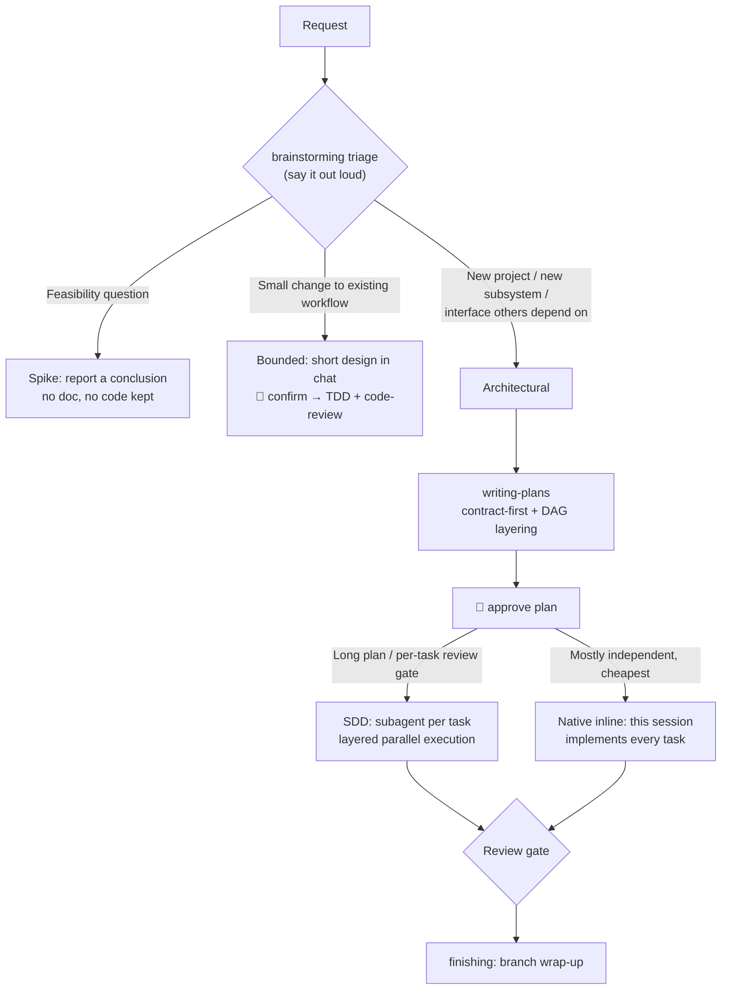
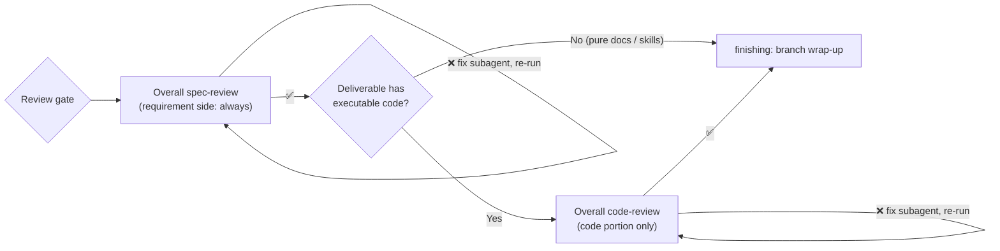

<div align="center">

# ⚡ Superpowers Lite

> **Contract-First · DAG Layered Parallelism · Enforced TDD · Routed Review Gates · Persistent Progress**

[](LICENSE)
[](https://github.com/obra/superpowers)
[](https://github.com/Geek-Bob/SuperpowersLite/pulls)

<br>

[🇨🇳 **中文**](./README.md)

</div>

---

> 🎯 A lightweight, deeply customized fork of Superpowers. Transforms the "code-copy" pattern into a precision engineering workflow: **Contract-First + Dynamic DAG Layered Parallelism + Mandatory Review Gates**.

---

## 📖 Table of Contents

- [💡 Why Lite](#-why-lite)
- [🚀 Quick Start](#-quick-start)
- [🔄 Workflow](#-workflow-three-tier-triage)
- [📋 Differences vs Official](#-differences-vs-official)
- [📂 Skill Inventory](#-skill-inventory)
- [🔧 Alternative: Overlay Install](#-alternative-overlay-install)
- [📜 License](#-license)

---

## 💡 Why Lite

Four keywords sum up the differences from upstream: **Contract-First · Layered Parallelism · Routed Review Gates · Fully Chinese**.

- **Plans are acceptance contracts, not code clones** — implementers do real TDD (Red → Green → Refactor), no copy-paste shortcut
- **Produces / Consumes auto DAG layering** — same-layer tasks run in parallel, cross-layer serial, no waiting
- **Review gates routed by deliverable** — spec-review always runs; code-review only when the deliverable contains executable code. Cheap and accurate
- **Zero helper scripts** — context blocking by rules (pointer dispatch + subagents run git diff themselves), no script-borne defects

---

## 🚀 Quick Start

**Uninstall the official superpowers first** (same plugin name — mutually exclusive):

```bash
claude plugin uninstall superpowers
```

**Two-step install:**

```bash
claude plugin marketplace add https://github.com/Geek-Bob/SuperpowersLite.git
claude plugin install superpowers@superpowerslite
```

Works out of the box: 13 skills + a Chinese bootstrap injected into every session (SessionStart hook). Upgrade with `claude plugin update superpowers`.

**Verify it worked:** `claude plugin list` shows `superpowers@superpowerslite` (enabled); a new session opens with the Chinese superpowers bootstrap; when you describe a request, Claude announces its triage (Spike / Bounded / Architectural) before starting.

> The marketplace address must be the full HTTPS URL — the `Geek-Bob/SuperpowersLite` shorthand goes through SSH clone and fails on machines without a configured host key. To keep the official plugin as the base, see the [overlay alternative](#-alternative-overlay-install) at the end.

---

## 🔄 Workflow: Three-Tier Triage

Every request is first **triaged** by `brainstorming` into one of three fixed paths: **Spike** / **Bounded** / **Architectural**. You must say the classification out loud, go heavier when in doubt, and only ever escalate — never downgrade — if hidden complexity surfaces.

| Path | When | Output | Ends at |
|------|------|--------|---------|
| **Spike** | A feasibility question ("can we…", "rough is fine") — the output is an **answer**, not code worth keeping | Question + 2-3 sentence probe plan | A conclusion (no doc, no code worth keeping) |
| **Bounded** | A small change to an **existing workflow** in this repo (a flag, a small endpoint, a single-file fix) | A short design in chat | TDD straight into implementation + requesting-code-review |
| **Architectural** | New project, new subsystem, assembling a refactor, changing an interface others depend on | Written spec + plan | writing-plans → execution (either of two) |

> 🎚️ **Gates are stage-scoped:** approval at the conversation level only authorizes writing the spec; approval of the written spec is what unlocks writing-plans. Each reply approves only the stage currently on the table. Every 🛑 in the flow waits for the user's nod.





Task-level details (per-task flow, progress persistence, forbidden actions) live in the corresponding skill files under `skills/`.

---

## 📋 Differences vs Official

| # | Official | Lite |
|:--:|----------|------|
| 🧠 | Plans are code clones (500-2000 lines), subagents copy-paste | Plans are acceptance contracts (100-300 lines), subagents do real TDD |
| 🎨 | Text-only design, no visualization | ASCII diagrams for interaction + Mermaid formal diagrams + classDiagram contracts |
| ⚡ | All tasks serial | DAG layered: same-layer parallel, cross-layer serial |
| 🔗 | No contract mechanism, interfaces written ad-hoc | Contracts & Interfaces chapter mandatory, all implementers share one API |
| 🧪 | TDD optional, subagents often skip | Enforced TDD loading, Red → Green → Refactor |
| 👀 | Controller self-reviews | **Routed review gates** (spec-review always; code-review when the deliverable has executable code), reviewer has full global perspective |
| 💾 | TaskUpdate only, progress lost on session end | Edit plan file checkbox in real-time, file is persistent source of truth |
| 🔧 | Fixes lose context | New implementer + original task context + review issue list |
| 📋 | Upstream keeps both a self-review step and orphan review templates | Document reviews are **self-review**, independent perspective reserved for the user gate |
| 🛤️ | Two execution paths, but executing-plans is a 64-line stub | Both paths implemented; Native inline rewritten minimally (zero scripts) |
| 🏗️ | Code review lacks architecture checks | Added file responsibility/testability/structure compliance/bloat checks |

Three differences worth expanding on:

**Routed review gates.** After all tasks complete, the review gate runs: the requirement side (coverage / inter-task consistency / scope creep) always runs; the quality side runs only when the deliverable contains executable code, and only over the code — for pure doc/skill tasks, code-review's checklist (error handling, type safety, schema migration) is meaningless for Markdown and only yields noise findings. Embedded code snippets do get reviewed — a `.md` file buys no free pass.

**Self-review for documents.** Upstream `Self-Review` says plainly "not a subagent dispatch", and the two `*-document-reviewer-prompt.md` files are deliberate orphans there. Lite had mistakenly wired them back in; the 2026-09-23 re-check corrected this to **running the checklist yourself** (structural quality + requirement fidelity, one pass each), reserving the independent perspective for the user gate — the last and most effective one.

**Two execution paths.** `executing-plans` borrows upstream v6.4.1's Native inline execution, rewritten minimally (~100 lines, zero scripts) — this session implements every task itself, the **cheapest** option. The dividing line vs SDD: whether you want a per-task review gate × how long the plan is × fixed overhead × task count. Both share the same precondition (tasks mostly independent); tightly coupled tasks suit neither.

---

## 📂 Skill Inventory

| Skill | Change |
|-------|--------|
| `brainstorming` | 🔴 Three-tier triage + intent reflection + diagram-driven + contract & interfaces + self-review |
| `writing-plans` | 🔴 Full rewrite: task decomposition + Produces/Consumes + DAG layering + Rulings |
| `subagent-driven-development` | 🔴 Routed review gates + pointer dispatch + layered parallel execution |
| `executing-plans` | 🆕 Native inline execution (zero scripts, cheapest) |
| `requesting-code-review` | 🔵 Chinese + added architecture / file responsibility checks |

The other 8 skills (TDD, systematic debugging, worktrees, branch wrap-up, etc.) come from upstream, Chinese-localized only. Full per-item rulings (adopt / reject + reasons): [`UPSTREAM.md`](UPSTREAM.md).

---

## 🔧 Alternative: Overlay Install

For when you want to keep the official plugin as the base (official base + Lite skill overlay).

<details>
<summary><b>Click to expand the full procedure</b></summary>

```bash
# Clone the Lite repository
git clone https://github.com/Geek-Bob/SuperpowersLite.git

# Register the official plugin (for non-skill files: hooks, config, etc.)
claude plugins install superpowers@obra

# Overwrite official skills with Lite skills (the version dir is chosen by the
# plugin manager — never hard-code it)
SP="$HOME/.claude/plugins/cache/claude-plugins-official/superpowers"
VER=$(ls -1 "$SP" | sort -V | tail -1)
[ -n "$VER" ] || { echo "error: $SP missing or empty"; exit 1; }

# Delete-before-copy: cp -r only overwrites same-name files and never removes
# extras — every official file Lite deleted (incl. the unauthenticated
# server.cjs) would otherwise survive the overlay
rm -rf "$SP/$VER/skills/writing-skills" \
       "$SP/$VER/skills/diagnosing-superpowers" \
       "$SP/$VER/skills/brainstorming/scripts" \
       "$SP/$VER/skills/brainstorming/visual-companion.md" \
       "$SP/$VER/skills/subagent-driven-development/scripts" \
       "$SP/$VER/skills/subagent-driven-development/task-reviewer-prompt.md" \
       "$SP/$VER/skills/subagent-driven-development/re-review-prompt.md" \
       "$SP/$VER/skills/executing-plans/scripts" \
       "$SP/$VER/skills/using-superpowers/references/antigravity-tools.md" \
       "$SP/$VER/skills/using-superpowers/references/claude-code-tools.md" \
       "$SP/$VER/skills/using-superpowers/references/hermes-tools.md" \
       "$SP/$VER/skills/using-superpowers/references/muse-tools.md" \
       "$SP/$VER/skills/using-superpowers/references/pi-tools.md"
cp -r SuperpowersLite/skills/* "$SP/$VER/skills/"

# Verify: the bootstrap carries the triage (Spike), executing-plans is
# present, and no Lite-deleted official file survived
grep -q "Spike" "$SP/$VER/skills/using-superpowers/SKILL.md" \
  && grep -q "6.4.1-l2" "$SP/$VER/skills/using-superpowers/SKILL.md" \
  && ls "$SP/$VER/skills/executing-plans/SKILL.md" \
  && [ ! -e "$SP/$VER/skills/writing-skills" ] \
  && [ ! -e "$SP/$VER/skills/brainstorming/scripts" ] \
  && echo "install verified"
```

> ⚠️ **Re-run the overlay after every official plugin upgrade.** An upgrade lands in a new version dir and silently reverts to the official original (English, no triage) with no error whatsoever.

</details>

---

## ⚠️ Notes

> 🟡 **Spec & Plan phases require your review** — read carefully before confirming

> 🟢 **Execution is fully automatic** — the Controller won't pause between tasks

> 🔴 **If unsure about any task result** — interrupt anytime, the Controller will stop for inspection

---

## 📜 License

Modified from [Superpowers](https://github.com/obra/superpowers). Licensed under the original project's [MIT](LICENSE) license.

---

<div align="center">

<br>

[⬆ Back to top](#-superpowers-lite) · [🇨🇳 中文](./README.md)

<br>

</div>
