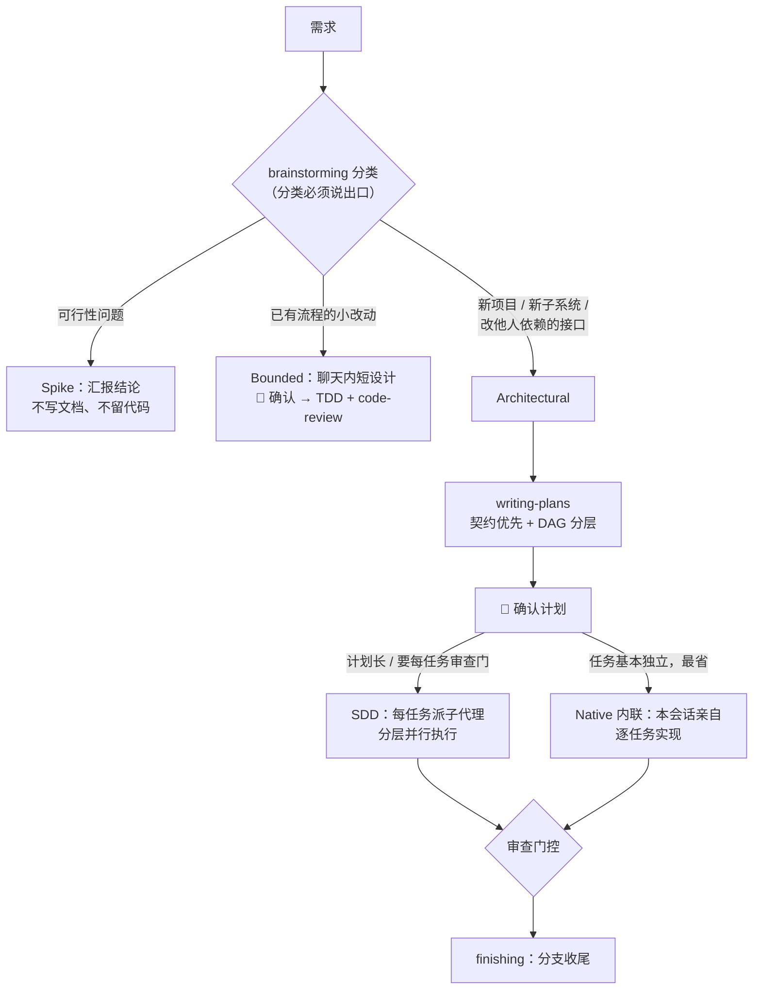
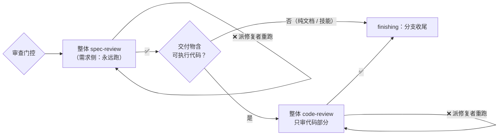

<div align="center">

# ⚡ Superpowers Lite

> **契约优先 · DAG 分层并行 · 强制 TDD · 审查门控分流 · 进度持久化**

[](LICENSE)
[](https://github.com/obra/superpowers)
[](https://github.com/Geek-Bob/SuperpowersLite/pulls)

<br>

[🇬🇧 **English**](./README.en.md)

</div>

---

> 🎯 官方 Superpowers 的轻量化深度定制版。将"代码副本"模式彻底改造为"契约优先 + 动态 DAG 分层并行 + 强制审查门控"的精密工程师工作流。

---

## 📖 目录

- [💡 为什么是 Lite](#-为什么是-lite)
- [🚀 快速开始](#-快速开始)
- [🔄 工作流](#-工作流三路径分档)
- [📋 与官方的差异](#-与官方的差异)
- [📂 技能清单](#-技能清单)
- [🔧 备选：覆盖式安装](#-备选覆盖式安装)
- [📜 许可](#-许可)

---

## 💡 为什么是 Lite

四个关键词概括与官方的差异：**契约优先 · 分层并行 · 审查门控 · 全中文**。

- **计划是验收契约，不是代码副本**——实现者真 TDD（Red → Green → Refactor），不走抄代码捷径
- **Produces / Consumes 自动 DAG 分层**——同层任务并行执行，跨层串行，互不等待
- **审查门控按交付物分流**——spec-review 永远跑，code-review 只在交付物含可执行代码时审，省而准
- **零辅助脚本**——上下文阻断靠规则（指针化派发 + 子代理自跑 git diff），不引入脚本自身的缺陷

---

## 🚀 快速开始

**已装官方 superpowers 先卸载**（两者同名互斥，不卸会冲突）：

```bash
claude plugin uninstall superpowers
```

**两步安装：**

```bash
claude plugin marketplace add https://github.com/Geek-Bob/SuperpowersLite.git
claude plugin install superpowers@superpowerslite
```

装完即用：13 技能 + 每会话自动注入中文引导（SessionStart hook）。升级用 `claude plugin update superpowers`。

**验证装对了：** `claude plugin list` 显示 `superpowers@superpowerslite`（enabled）；开新会话开头有中文 superpowers 引导；提需求时 Claude 先宣告路径分类（Spike / Bounded / Architectural）再动手。

> 市场地址必须用完整 HTTPS URL——`Geek-Bob/SuperpowersLite` 简写形式走 SSH clone，未配 host key 的机器会失败。想保留官方插件主体的，见[文末备选方式](#-备选覆盖式安装)。

---

## 🔄 工作流：三路径分档

所有需求先经 `brainstorming` **分类**，路径名固定为 **Spike** / **Bounded** / **Architectural**。分类必须说出口，怀疑时走重的那条，中途发现复杂度只升不降。

| 路径 | 判定 | 产出 | 终点 |
|------|------|------|------|
| **Spike** | 可行性问题（"能不能…"、"糙一点没关系"），产出是**答案**而非要保留的代码 | 问题 + 试探方案（2-3 句话） | 汇报结论（不写文档、不留代码） |
| **Bounded** | 本仓库**已有流程**的小改动（加 flag、小端点、单文件修复） | 聊天内短设计 | TDD 直接实现 + requesting-code-review |
| **Architectural** | 新项目、新子系统、重构组件拼装、改他人依赖的接口 | 书面 spec + 计划 | writing-plans → 执行二选一 |

> 🎚️ **门控是阶段级授权：** 对话层批准只允许写 spec；书面 spec 批准才解锁 writing-plans；一次回复只批准当前呈现的那个阶段。全流程每道 🛑 都等用户点头。





任务级细节（Per-Task 流程、进度持久化、禁止事项）见 `skills/` 对应技能文件。

---

## 📋 与官方的差异

| # | 官方 | Lite |
|:--:|------|------|
| 🧠 | 计划是代码副本（500-2000 行），子代理抄代码 | 计划是验收契约（100-300 行），子代理真 TDD |
| 🎨 | 设计纯文本，无可视化 | ASCII 框图交互 + Mermaid 正式图表 + classDiagram 契约图 |
| ⚡ | 所有任务串行执行 | DAG 分层：同层并行、跨层串行 |
| 🔗 | 无契约机制，接口各写各的 | 契约与接口章节强制产出，所有实现者同一份接口 |
| 🧪 | TDD 可选，子代理常跳过 | 强制加载 TDD 技能，Red → Green → Refactor |
| 👀 | Controller 自我审查 | **审查门控分流**（spec-review 必跑 + code-review 按交付物），子代理有完整全局观 |
| 💾 | 只标记 TaskUpdate，会话结束进度丢失 | Edit 计划文件 checkbox 实时回写，文件是持久化真相源 |
| 🔧 | 修复丢上下文 | 新实现者 + 原始任务上下文 + 审查问题清单 |
| 📋 | 官方既有自审也有孤儿审查模板 | 文档**自审化**，独立视角留给用户门控 |
| 🛤️ | 两条执行路径但 executing-plans 仅 64 行 stub | 两条路径都实装；Native 内联极简重写（0 脚本） |
| 🏗️ | 代码审查无架构检查 | 新增文件职责/可测试性/结构合规/文件膨胀检查 |

三处值得展开的差异：

**审查门控分流。** 所有任务完成后进入审查门控：需求侧 spec-review（覆盖度 / 一致性 / 范围蔓延）永远跑；质量侧 code-review 仅当交付物含可执行代码时跑、且只审代码部分——纯文档/技能任务的 code-review 检查项（错误处理、类型安全、Schema 迁移）对 Markdown 是无效项，硬跑只产噪音。夹带内嵌代码片段时只审那些片段，不因 `.md` 免审。

**文档自审化。** 官方 `Self-Review` 明写 "not a subagent dispatch"，两个 `*-document-reviewer-prompt.md` 在官方已是刻意孤儿。Lite 曾误判为「孤儿引用」接回工作流，2026-09-23 复核纠正为**作者自己跑清单**（结构质量 + 需求一致性各一遍），独立视角留给用户门控——那是最后一道，也是最有效的一道。

**两条执行路径。** `executing-plans` 借官方 v6.4.1 的 Native 内联执行极简重写（~100 行、0 脚本）——本会话亲自逐任务实现，**最省**。与 SDD 的分界：要不要每任务审查门 × 计划长不长 × 固定开销 × 任务数。两者前提相同（任务基本独立），紧耦合任务两条路都不适用。

---

## 📂 技能清单

| 技能 | 改动 |
|------|------|
| `brainstorming` | 🔴 三路径分类 + 意图回述 + 图表驱动 + 契约与接口 + 自审 |
| `writing-plans` | 🔴 完全重写：任务分解 + Produces/Consumes + DAG 分层 + Rulings |
| `subagent-driven-development` | 🔴 审查门控分流 + 指针化派发 + 分层并行执行 |
| `executing-plans` | 🆕 Native 内联执行（0 脚本，最省） |
| `requesting-code-review` | 🔵 中文化 + 新增架构 / 文件职责检查点 |

其余 8 个技能（TDD、系统化调试、worktree、分支收尾等）来自官方，仅中文化。完整逐项裁决（采纳 / 拒绝 + 原因）见 [`UPSTREAM.md`](UPSTREAM.md)。

---

## 🔧 备选：覆盖式安装

适合想保留官方插件主体的场景（官方底座 + Lite 技能覆盖）。

<details>
<summary><b>点击展开完整步骤</b></summary>

```bash
# 克隆 Lite 仓库
git clone https://github.com/Geek-Bob/SuperpowersLite.git

# 注册官方插件（获取非技能文件：hooks、配置等）
claude plugins install superpowers@obra

# 用 Lite 技能覆盖官方技能（版本目录由插件管理器决定，别写死）
SP="$HOME/.claude/plugins/cache/claude-plugins-official/superpowers"
VER=$(ls -1 "$SP" | sort -V | tail -1)
[ -n "$VER" ] || { echo "错误：$SP 不存在或为空"; exit 1; }

# 先删后拷：cp -r 只覆盖同名文件、不删多余文件——Lite 已删的官方文件（含无鉴权的 server.cjs）会全部残留
rm -rf "$SP/$VER/skills/writing-skills" \
       "$SP/$VER/skills/diagnosing-superpowers" \
       "$SP/$VER/skills/brainstorming/scripts" \
       "$SP/$VER/skills/brainstorming/visual-companion.md" \
       "$SP/$VER/skills/subagent-driven-development/scripts" \
       "$SP/$VER/skills/subagent-driven-development/task-reviewer-prompt.md" \
       "$SP/$VER/skills/subagent-driven-development/re-review-prompt.md" \
       "$SP/$VER/skills/executing-plans/scripts" \
       "$SP/$VER/skills/using-superpowers/references/antigravity-tools.md" \
       "$SP/$VER/skills/using-superpowers/references/claude-code-tools.md" \
       "$SP/$VER/skills/using-superpowers/references/hermes-tools.md" \
       "$SP/$VER/skills/using-superpowers/references/muse-tools.md" \
       "$SP/$VER/skills/using-superpowers/references/pi-tools.md"
cp -r SuperpowersLite/skills/* "$SP/$VER/skills/"

# 校验：bootstrap 含三路径分类（Spike），executing-plans 已就位，且 Lite 已删的官方文件无残留
grep -q "Spike" "$SP/$VER/skills/using-superpowers/SKILL.md" \
  && grep -q "6.4.1-l2" "$SP/$VER/skills/using-superpowers/SKILL.md" \
  && ls "$SP/$VER/skills/executing-plans/SKILL.md" \
  && [ ! -e "$SP/$VER/skills/writing-skills" ] \
  && [ ! -e "$SP/$VER/skills/brainstorming/scripts" ] \
  && echo "安装校验通过"
```

> ⚠️ **官方插件升级后必须重跑覆盖。** 升级会落到新的版本目录，Lite 覆盖层留在旧目录，运行时静默回退成官方原版（英文、无三路径），且不会有任何报错。

</details>

---

## ⚠️ 注意事项

> 🟡 **Spec 和 Plan 阶段**需要你**主动审阅**，仔细看完再确认

> 🟢 **执行阶段是全自动的**，Controller 不会在任务之间停下来问你

> 🔴 **如果对某个任务结果有疑虑**，随时打断，Controller 会停下来让你检查

---

## 📜 许可

基于 [Superpowers](https://github.com/obra/superpowers) 修改，遵循原项目 [MIT](LICENSE) 许可协议。

---

<div align="center">

<br>

[⬆ 返回顶部](#-superpowers-lite) · [🇬🇧 English](./README.en.md)

<br>

</div>
