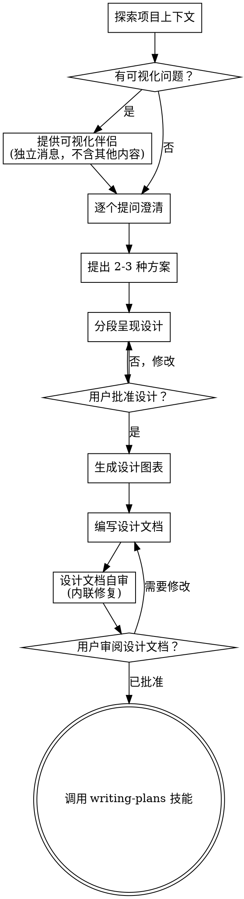
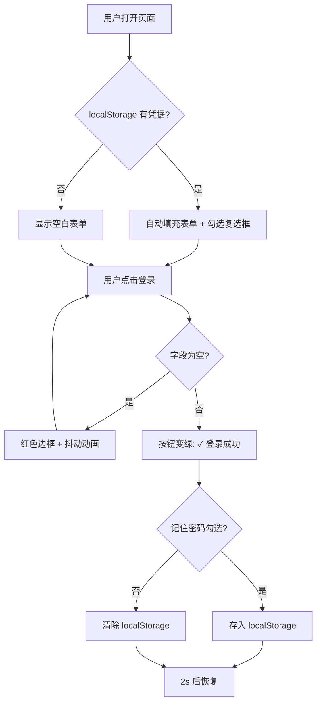
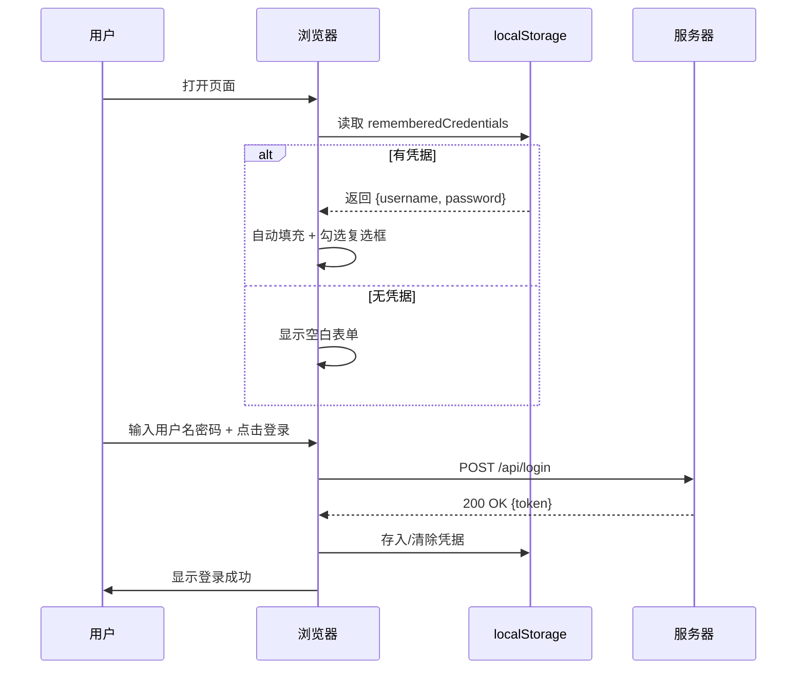
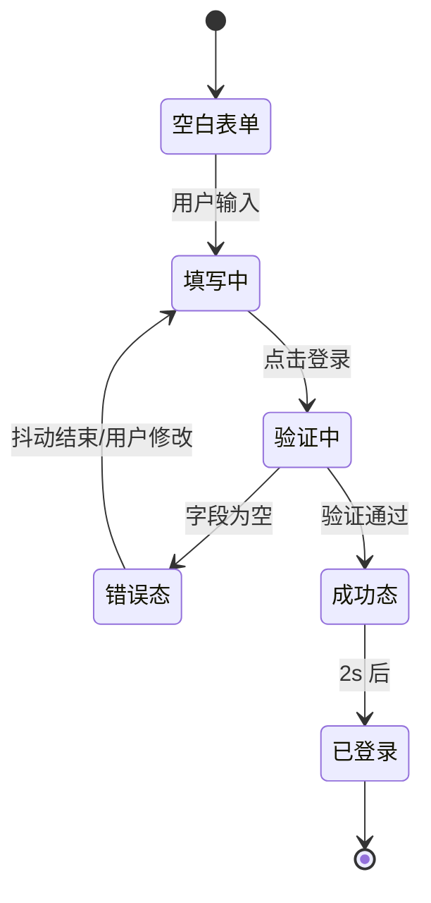
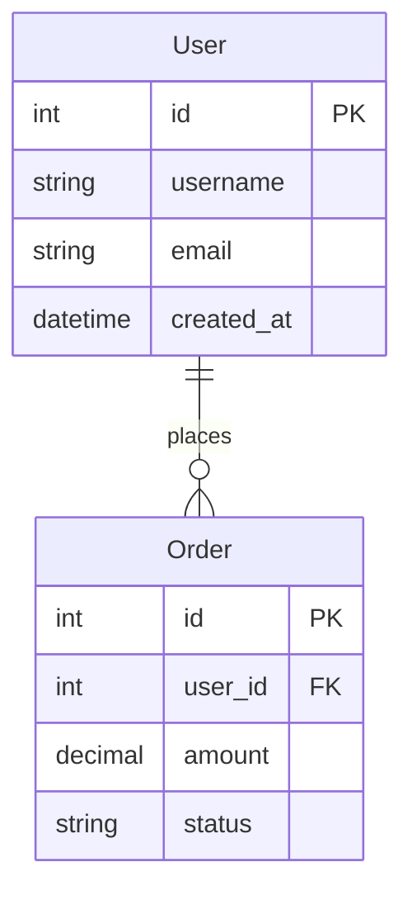

# 头脑风暴：从想法到设计

通过自然的协作对话，将想法转化为完整的设计和规格文档。

首先了解当前项目上下文，然后逐个提问以细化想法。一旦你理解要构建什么，呈现设计方案并获取用户批准。

<HARD-GATE>
在呈现设计方案并获得用户批准之前，禁止调用任何实现技能、编写任何代码、搭建任何项目或采取任何实现行动。无论项目看起来多简单，此规则适用于所有项目。
</HARD-GATE>

## 反模式："这太简单了，不需要设计"

每个项目都要走这个流程。待办列表、单函数工具、配置变更——全部都要。"简单"项目正是未经审视的假设造成最多返工的地方。设计可以简短（真正简单的项目几句话即可），但你必须呈现并获得批准。

## 检查清单

你必须为以下每项创建任务并按顺序完成：

1. **探索项目上下文** — 检查文件、文档、最近的提交
2. **提供可视化伴侣**（如果话题会涉及可视化问题）— 这是独立的消息，不与澄清问题合并。详见下方可视化伴侣章节。
3. **逐个提问澄清** — 一次一个，理解目的/约束/成功标准
4. **提出 2-3 种方案** — 包含权衡和你的推荐
5. **呈现设计方案** — 按复杂度分段呈现，每段获取用户批准
6. **生成设计图表** — 根据项目类型生成对应图表（详见下方"图表驱动设计"章节）
7. **编写设计文档** — 保存到 `docs/superpowers/specs/YYYY-MM-DD-<主题>-design.md` 并提交
8. **设计文档自审** — 快速内联检查占位符、矛盾、歧义、范围、图表完整性（详见下文）
9. **用户审阅书面设计文档** — 在继续之前请用户审阅设计文档文件
10. **过渡到实现** — 调用 writing-plans 技能创建实施计划

## 流程



**终态是调用 writing-plans。** 禁止调用 frontend-design、mcp-builder 或任何其他实现技能。头脑风暴之后唯一调用的技能是 writing-plans。

## 流程详解

**理解想法：**

- 首先检查当前项目状态（文件、文档、最近的提交）
- 在问细节问题之前，评估范围：如果请求描述了多个独立子系统（例如"构建一个包含聊天、文件存储、计费和分析的平台"），立即指出这一点。不要花时间细化一个需要先拆分的项目的细节。
- 如果项目对于单个设计文档来说太大，帮助用户拆分为子项目：有哪些独立的部分、它们之间如何关联、应该按什么顺序构建？然后按正常设计流程对第一个子项目进行头脑风暴。每个子项目走自己的 设计文档 → 计划 → 实现 循环。
- 对于范围适当的项目，逐个提问以细化想法
- 尽可能使用选择题，但开放式问题也可以
- 每条消息只问一个问题——如果话题需要更多探索，拆成多个问题
- 专注于理解：目的、约束、成功标准

**探索方案：**

- 提出 2-3 种不同的方案及各自的权衡
- 以对话方式呈现选项，附带你的推荐和理由
- 先展示你推荐的方案并解释原因

**呈现设计：**

- 一旦你确信理解了要构建什么，呈现设计方案
- 每段的详细程度匹配其复杂度：简单的用几句话，复杂的可以到 200-300 字
- 每段之后询问是否看起来没问题
- 覆盖：架构、组件、数据流、错误处理、测试
- 如果有不清楚的地方，随时准备回去澄清

**为隔离性和清晰度设计：**

- 将系统拆分为更小的单元，每个单元有一个明确的职责，通过定义清晰的接口通信，并且可以独立理解和测试
- 对于每个单元，你应该能回答：它做什么、如何使用它、它依赖什么？
- 别人能在不读内部实现的情况下理解一个单元做什么吗？你能在不破坏调用方的情况下修改内部实现吗？如果不能，边界需要改进。
- 小而边界清晰的单元也更容易让你处理——当代码量控制在一次能完整理解的范围内时，你的推理最准确，编辑也最可靠。当文件变得很大时，通常意味着它承担了太多职责。

**在已有代码库中工作：**

- 在提出变更之前探索当前结构。遵循已有的模式。
- 当已有代码存在影响当前工作的问题时（例如文件过大、边界不清晰、职责纠缠），将有针对性的改进纳入设计——就像优秀的开发者在工作中改进代码一样。
- 不要提出无关的重构。专注于服务于当前目标的内容。

## 图表驱动设计

设计文档必须包含图表。图比文字更精确，一图胜千言，消除歧义。

### 图表类型选择

根据项目类型选择合适的图表组合：

| 图表类型 | 格式 | 适用场景 |
|---------|------|---------|
| UI 布局原型 | **ASCII 框图** | 页面结构、组件排列、布局关系 |
| 架构图 | **ASCII 框图** | 系统拓扑、模块依赖、部署结构、组件关系 |
| 交互流程图 | **Mermaid** `flowchart` | 用户操作路径、业务处理流程、决策分支 |
| 时序图 | **Mermaid** `sequenceDiagram` | API 调用链、组件通信、请求-响应流程 |
| 状态图 | **Mermaid** `stateDiagram-v2` | UI 状态切换、实体生命周期、状态机 |
| ER 图 | **Mermaid** `erDiagram` | 数据模型、实体关系、表结构 |

**选择规则：**

```
是"怎么摆、怎么连"？ → ASCII 框图（布局、架构）
是"怎么走、怎么变"？ → Mermaid（流程、时序、状态）
```

### 各项目类型必备图表

| 项目类型 | 必备图表 |
|---------|---------|
| 🖥️ UI 项目（前端页面/组件） | ASCII 布局原型图 + Mermaid 交互流程图 + Mermaid 状态图 |
| ⚙️ 后端/API 项目 | ASCII 架构图 + Mermaid 时序图 + Mermaid ER 图 |
| 🔗 全栈项目 | ASCII 布局原型 + ASCII 架构图 + Mermaid 交互流程图 + Mermaid 时序图 |

### ASCII 框图规范

#### UI 布局原型图

用 Unicode 框线字符直接"画"出界面结构。每个 UI 页面/组件必须有布局原型图。

**框线字符集：**
```
─ │ ┌ ┐ └ ┘ ├ ┤ ┬ ┴ ┼
```

**示例 — 登录页面：**

```
┌─────────────────────────────────────────┐
│            ⚡ 系统登录                    │
├─────────────────────────────────────────┤
│                                          │
│  ┌─ 用户名 ──────────────────────────┐  │
│  │ 请输入用户名                        │  │
│  └────────────────────────────────────┘  │
│                                          │
│  ┌─ 密码 ────────────────────────────┐  │
│  │ ••••••••                   👁️     │  │
│  └────────────────────────────────────┘  │
│                                          │
│  ☐ 记住密码                              │
│                                          │
│  ┌────────────────────────────────────┐  │
│  │            登  录                   │  │
│  └────────────────────────────────────┘  │
│                                          │
│  还没有账号？立即注册 →                   │
│                                          │
│  ⚠ 此 Demo 不会将密码发送到任何服务器     │
└─────────────────────────────────────────┘
```

**要求：**
- 标注核心交互区域（按钮、输入框、导航、状态提示）
- 复杂交互区域可加注释说明行为（例如 `← 点击切换显示/隐藏`）
- 宽度控制在 45-60 字符，保证在 GitHub 上可读
- 多状态 UI 需画出关键状态的差异（如：正常态 vs 错误态 vs 成功态）

#### 架构图

用 ASCII 框图表达系统拓扑、模块依赖、组件关系。

**示例 — 微服务架构：**

```
┌──────────────┐     ┌──────────────┐     ┌──────────────┐
│   API        │────▶│   用户服务    │────▶│   PostgreSQL │
│   Gateway    │     │   :3001      │     │  用户库       │
│   :8080      │     └──────┬───────┘     └──────────────┘
└──────┬───────┘            │
       │            ┌───────┴───────┐     ┌──────────────┐
       │            │   订单服务     │────▶│   PostgreSQL │
       └───────────▶│   :3002      │     │  订单库       │
                    └───────────────┘     └──────────────┘
```

**示例 — 组件树/模块关系：**

```
App
├── Header
│   ├── Logo
│   └── NavMenu
│       ├── NavItem("首页")
│       ├── NavItem("关于")
│       └── NavItem("联系")
├── Main
│   └── Router
│       ├── HomePage
│       └── AboutPage
└── Footer
```

**要求：**
- 标注组件/模块名称和关键标识（端口、路径、职责）
- 箭头表达数据流/调用方向
- 层级缩进表达包含/依赖关系
- 宽度控制在 55-70 字符

### Mermaid 图表规范

Mermaid 图表直接嵌入 markdown 代码块中，GitHub 原生渲染为 SVG。

#### 交互流程图 (flowchart)



#### 时序图 (sequenceDiagram)



#### 状态图 (stateDiagram-v2)



#### ER 图 (erDiagram)



**要求：**
- 节点用简短中文描述（便于业务理解），技术细节放注释
- 流程图覆盖正常路径 + 异常分支 + 边界条件
- 时序图标注参与者和消息方向
- 状态图覆盖所有关键状态和转换条件

### 生成时机

在用户批准设计方案后、编写设计文档前，根据项目类型生成全部必备图表。图表作为设计文档的核心组成部分，与文字描述一同写入 `docs/superpowers/specs/`。

## 设计之后

**文档化：**

- 将已验证的设计（设计文档）写入 `docs/superpowers/specs/YYYY-MM-DD-<主题>-design.md`
  - （用户偏好的设计文档位置会覆盖此默认值）
- 如果可用，使用 elements-of-style:writing-clearly-and-concisely 技能
- 将设计文档提交到 git

**设计文档自审：**
写完设计文档后，用新的眼光审视它：

1. **占位符扫描：** 是否有"TBD"、"TODO"、不完整的章节或模糊的需求？修复它们。
2. **内部一致性：** 各章节之间是否有矛盾？架构图是否与功能描述匹配？流程图是否覆盖了文字描述的所有路径？
3. **范围检查：** 是否足够聚焦于单个实施计划，还是需要进一步拆分？
4. **歧义检查：** 是否有任何需求可以被两种不同方式解读？如果有，选定一种并明确表达。
5. **图表完整性：** 是否缺少项目类型对应的必备图表？ASCII 框图框线是否对齐？Mermaid 语法是否正确？
6. **图表可渲染：** Mermaid 代码块是否使用正确语法？ASCII 图在 80 字符宽度内是否对齐？

内联修复任何问题。不需要重新审查——修复后直接继续。

**用户审阅门控（强制阻断）：**
设计文档自审循环通过后，**你必须停下来等待用户确认**才能继续：

> "设计文档已写入 `<路径>`。请审阅这份设计文档，是否有需要修改的地方？确认无误后我们再进入实施计划阶段。"

这是强制阻断。在用户明确确认设计文档之前，禁止调用 writing-plans。
如果用户要求修改，进行修改，重新运行设计文档自审，然后再次呈现。
重复直到用户明确确认设计文档正确。

**实现：**

- 调用 writing-plans 技能创建详细的实施计划
- 禁止调用任何其他技能。writing-plans 是下一步。

## 核心原则

- **一次一个问题** — 不要用多个问题压倒用户
- **优先使用选择题** — 可能时比开放式问题更容易回答
- **无情地 YAGNI** — 从所有设计中移除不必要的功能
- **探索替代方案** — 在确定之前始终提出 2-3 种方案
- **渐进式验证** — 呈现设计，获取批准后再继续
- **保持灵活** — 当某些内容不清楚时，回去澄清

## 可视化伴侣

一个基于浏览器的伴侣工具，用于在头脑风暴期间展示原型、图表和可视化选项。它是一个工具——不是一种模式。接受伴侣意味着它在有益于可视化处理的问题上可用；并不意味着每个问题都要通过浏览器。

**提供伴侣：** 当你预计接下来的问题会涉及可视化内容（原型、布局、图表）时，征求一次同意：
> "我们正在讨论的一些内容如果能通过浏览器展示可能会更容易理解。我可以在此过程中制作原型、图表、对比图和其他可视化内容。这个功能比较新，可能消耗较多 token。想试试吗？（需要打开本地 URL）"

**此提议必须是独立的消息。** 不要与澄清问题、上下文摘要或任何其他内容合并。该消息应仅包含上述提议，别无其他。等待用户回复后再继续。如果用户拒绝，继续纯文本头脑风暴。

**每个问题单独决策：** 即使用户接受了，对每个问题分别决定使用浏览器还是终端。测试标准：**用户通过看比通过读能更好地理解这个内容吗？**

- **使用浏览器** 处理真正可视化的内容——原型、线框图、布局对比、架构图、并排视觉设计
- **使用终端** 处理文本内容——需求问题、概念选择、权衡列表、A/B/C/D 文本选项、范围决策

关于 UI 话题的问题并不自动等于可视化问题。"在这个上下文中 personality 是什么意思？"是概念问题——用终端。"哪种向导布局更好？"是可视化问题——用浏览器。

如果他们同意使用伴侣，在继续之前阅读详细指南：
`skills/brainstorming/visual-companion.md`
