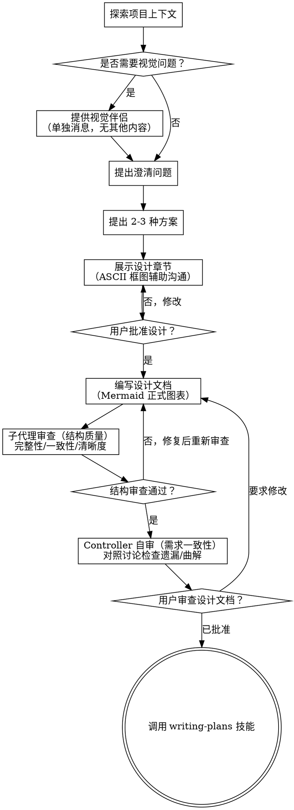
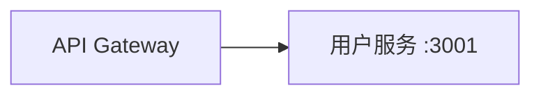
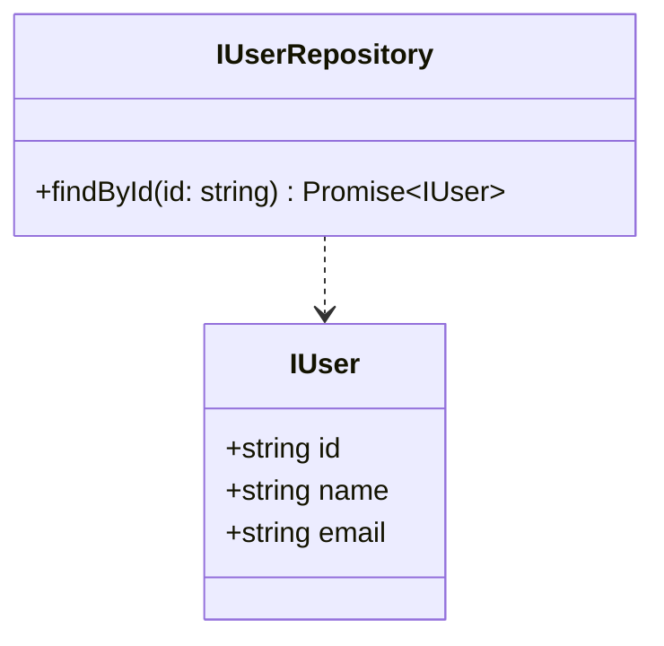

# 将创意转化为设计方案

通过自然的协作对话，将创意转化为完整的设计和规格文档。

首先了解当前项目上下文，然后逐一提问以完善创意。一旦理解了要构建的内容，展示设计方案并获得用户批准。

<HARD-GATE>
在展示设计方案并获得用户批准之前，不得调用任何实现技能、编写任何代码、搭建任何项目或采取任何实施行动。此规则适用于每个项目，无论其看似多么简单。
</HARD-GATE>

## 反模式："这个太简单了，不需要设计"

每个项目都要经历这个过程。待办事项列表、单功能工具、配置变更——无一例外。"简单"的项目恰恰是未经检验的假设造成最多无用功的地方。设计可以很简短（对于真正简单的项目只需几句话），但你必须展示它并获得批准。

## 反模式："纯文字就够了，不需要图"

复杂逻辑用纯文字描述，用户很难在脑中构建完整画面。架构怎么搭、页面怎么布局、数据怎么流动——用 ASCII 框图随手画出来，用户立刻能参与讨论。图不是文档装饰，是沟通工具。展示设计时不给图，等于让用户盲猜你的方案。

## 检查清单

你必须为以下每一项创建任务并按顺序完成：

1. **探索项目上下文** — 检查文件、文档、最近的提交
2. **提供视觉伴侣**（如果主题涉及视觉问题）— 这需要单独一条消息，不与澄清问题合并。请参阅下面的"视觉伴侣"部分。
3. **提出澄清问题** — 一次一个，理解目的/约束/成功标准
4. **提出 2-3 种方案** — 附上权衡分析和你的推荐
5. **展示设计（用 ASCII 图澄清）** — 按复杂度划分章节，用 ASCII 框图辅助沟通，每个章节获得用户批准（详见下方"展示设计"）
6. **编写设计文档** — 将设计方案 + Mermaid 正式图表 + 契约与接口写入 `docs/superpowers/specs/YYYY-MM-DD-<topic>-design.md` 并提交
7. **子代理审查（结构质量）** — 派独立子代理检查文档完整性、内部一致性、清晰度（详见下方"设计之后"）
8. **Controller 自审（需求一致性）** — 子代理通过后，Controller 对照原始讨论检查需求是否遗漏或曲解（见下文）
9. **用户审查设计文档** — 在继续前请用户审查设计文档文件
10. **过渡到实现** — 调用 writing-plans 技能创建实施计划

## 流程示意图



**终端状态是调用 writing-plans。** 不要调用 frontend-design、mcp-builder 或任何其他实现技能。头脑风暴之后唯一调用的技能是 writing-plans。

## 流程

**理解创意：**

- 首先查看当前项目状态（文件、文档、最近的提交）
- 在提出详细问题之前，评估范围：如果需求描述包含多个独立的子系统（例如，"构建一个包含聊天、文件存储、计费和分析的平台"），立即标记出来。不要花时间细化一个需要先拆解的项目细节。
- 如果项目太大无法放入单个规格，帮助用户拆分为子项目：有哪些独立模块，它们之间如何关联，应该按什么顺序构建？然后通过正常设计流程对第一个子项目进行头脑风暴。每个子项目都有自己的 设计文档 → 计划 → 实现 周期。
- 对于范围适当的项目，逐一提问以完善创意
- 尽量使用选择题，但开放式问题也可以
- 每条消息只提一个问题——如果一个主题需要更多探索，拆分成多个问题
- 重点理解：目的、约束、成功标准

**探索方案：**

- 提出 2-3 种不同方案，附上权衡分析
- 以对话方式呈现选项，给出你的推荐和理由
- 以你的推荐选项为先，并解释原因

**展示设计：用 ASCII 图澄清**

- 一旦你确信理解了要构建的内容，展示设计方案
- **用 ASCII 框图辅助沟通**——架构怎么搭、页面怎么布局、数据怎么流动，随手画出来，用户立刻能看图参与讨论
- 每个章节的篇幅根据其复杂程度调整：简单内容几句话，复杂内容可达到 200-300 字
- 每个章节后询问是否看起来正确
- 涵盖：架构、组件、数据流、错误处理、测试
- ASCII 框图追求快速、可改——这是和用户交互的工具，不是最终文档
- 如果某些内容不合理，随时准备返回去澄清

**ASCII → Mermaid 两阶段图表策略：**

| 阶段 | 工具 | 目的 | 风格 |
|------|------|------|------|
| 交互阶段（展示设计） | ASCII 框图 | 和用户边讨论边澄清，快速迭代 | 随手画，可擦改 |
| 文档阶段（写设计文档） | Mermaid | 嵌入 Spec 正式呈现，可渲染可维护 | 规范完整，嵌入 markdown |

```
交互阶段示例（快速，即时）：
┌──────────────┐     ┌──────────────┐
│   API        │────▶│   用户服务    │
│   Gateway    │     │   :3001      │
└──────────────┘     └──────────────┘

文档阶段（正式，可渲染）：

```

选图规则（两阶段通用）：

| 项目类型 | 交互阶段（ASCII） | 文档阶段（Mermaid） |
|---------|------------------|-------------------|
| 🖥️ UI | ASCII 布局原型 | flowchart + stateDiagram |
| ⚙️ 后端/API | ASCII 架构图 | sequenceDiagram + erDiagram |
| 🔗 全栈 | ASCII 布局 + ASCII 架构 | flowchart + sequenceDiagram |
| 📐 契约层（所有项目） | — | classDiagram（类型 + 接口关系） |

怎么摆、怎么连 → ASCII 框图。怎么走、怎么变 → Mermaid。

图表规范、示例和语法参考详见 `skills/brainstorming/diagram-driven-design.md`。

**隔离与清晰设计：**

- 将系统拆分为更小的单元，每个单元有一个清晰的职责，通过定义良好的接口通信，并且可以独立理解和测试
- 对于每个单元，你应该能够回答：它做什么、如何使用它、它依赖什么？
- 别人能否在不阅读内部实现的情况下理解一个单元的功能？你能否在不破坏使用者的情况下更改内部实现？如果不能，边界需要重新设计。
- 更小、边界清晰的单元也更容易让你处理——你更擅长推理能够同时放在上下文中的代码，当文件更专注时你的编辑也更可靠。当文件变得庞大时，通常表明它承担了过多职责。

**契约与接口（强制，并行基础）：**

模块之间的依赖本质上是对"接口/类型/契约"的依赖，而不是对"实现"的依赖。只要契约先定好，消费者和实现者就可以并行开发。

设计文档必须包含「契约与接口」章节，定义以下内容：

**1. 共享类型：** 所有模块使用的公共类型定义（Domain Types、DTO、Props）。每个类型包含名称、字段、约束。

**2. 模块接口：** 每个模块对外暴露的接口签名。只定义签名，不写实现——实现是计划阶段的事。

| 接口 | 方法签名 | 说明 |
|------|---------|------|
| `IUserRepository` | `findById(id: string): Promise<IUser \| null>` | 数据访问 |
| `IUserService` | `getUser(id: string): Promise<Result<IUser>>` | 业务逻辑 |

**3. 跨端契约（前后端分离项目必填）：** API endpoint、请求/响应格式。

| Endpoint | Method | Request | Response |
|----------|--------|---------|----------|
| `/api/users` | GET | — | `Result<IUser[]>` |
| `/api/users` | POST | `{ name, email }` | `Result<IUser>` |

**4. 命名约定：** 文件命名、类命名、方法命名规则。所有实现者遵守同一套规则。

**5. 数据流图（Mermaid）：** 谁调谁、数据怎么走。用 flowchart 或 sequenceDiagram 表达。

```
契约与接口用 classDiagram 表达类型和接口关系：


```

> **为什么必须写？** 没有契约，writing-plans 无法判断哪些任务可以并行。有了契约，所有实现者对着同一份接口写代码——不会出现 A 叫 `getUser(id: string)` B 叫 `getUser(id: number)` 的冲突。

**在现有代码库中工作：**

- 在提议变更之前探索现有结构。遵循现有模式。
- 如果现有代码存在影响工作的问题（例如，文件变得过大、边界不清晰、职责混杂），将有针对性的改进纳入设计——就像优秀开发者会改进他们正在处理的代码一样。
- 不要提议无关的重构。专注于服务当前目标。

## 设计之后

**文档化：**

- 将验证过的设计方案写入 `docs/superpowers/specs/YYYY-MM-DD-<topic>-design.md`
  - （用户对设计文档位置的偏好将覆盖此默认值）
- **交互阶段的 ASCII 框图转化为 Mermaid 正式图表**嵌入文档中
- **契约与接口用 classDiagram 表达**，嵌入文档中
- 如果可用，使用 elements-of-style:writing-clearly-and-concisely 技能
- 将设计文档提交到 git

**阶段一：子代理审查（结构质量）**

设计文档提交后，立即派发独立子代理审查。使用 `skills/brainstorming/spec-document-reviewer-prompt.md` 模板构建 prompt。

子代理检查文档的**结构质量**——它只读文档本身，不需要上下文：

| 检查维度 | 检查内容 |
|---------|---------|
| 完整性 | 是否缺少项目类型对应的必备图表？Mermaid 语法是否正确？ |
| 内部一致性 | 各章节之间是否有矛盾？架构图是否与功能描述匹配？流程图是否覆盖了文字描述的所有路径？ |
| 清晰度 | 是否有需求可以被两种不同方式解读？ |

子代理发现问题 → 修复文档 → 重新提交 → 重新审查，直到通过。

**阶段二：Controller 自审（需求一致性）**

子代理审查通过后，Controller 对照原始讨论检查**需求是否被正确传达**：

1. **需求遗漏：** 讨论中用户确认过的需求点，文档是否全部覆盖？
2. **需求曲解：** 文档中的设计是否曲解了用户的本意？
3. **假设检查：** Controller 在文档中做了哪些用户没说过但隐含的假设？是否应该标注出来？
4. **图表完整性：** 讨论中确定的 ASCII 概念是否都已转化为 Mermaid 正式图表？

内联修复所有问题。无需重新审查——修复后继续。

> **为什么是两个阶段？** 子代理没有参与需求讨论，无法判断"这个设计是否遗漏了用户提过的 X"。但它能从文档本身发现结构性问题——矛盾、歧义、语法错误。Controller 恰好相反——全程参与了讨论，知道用户确认过什么，能发现遗漏和曲解。两者互补，不是重复。

**用户审查门控（强制阻断）：**
设计文档自审循环通过后，**你必须停下来等待用户确认**才能继续：

> "设计文档已写入 `<路径>`。请审阅这份设计文档，是否有需要修改的地方？确认无误后我们再进入实施计划阶段。"

这是强制阻断。在用户明确确认设计文档之前，禁止调用 writing-plans。
如果用户要求修改，进行修改，重新运行设计文档自审，然后再次呈现。
重复直到用户明确确认设计文档正确。

**实现：**

- 调用 writing-plans 技能创建详细的实施计划
- 禁止调用任何其他技能。writing-plans 是下一步。

## 关键原则

- **一次一个问题** — 不要用多个问题让人应接不暇
- **优先使用选择题** — 在可能的情况下比开放式问题更容易回答
- **严格遵循 YAGNI** — 从所有设计中移除不必要的功能
- **探索替代方案** — 在确定之前总是提出 2-3 种方案
- **增量验证** — 展示设计，在继续之前获得批准
- **保持灵活** — 当某些内容不合理时，返回去澄清

## 视觉伴侣

一个基于浏览器的伴侣工具，用于在头脑风暴期间展示模拟图、示意图和视觉选项。作为一个工具提供——而非一种模式。接受伴侣意味着在需要视觉处理的问题上可以使用它；但并不意味着每个问题都要通过浏览器。

**提供伴侣：** 当你预计即将提出的问题将涉及视觉内容（模拟图、布局、示意图）时，提供一次征求同意：

> "我们正在处理的某些内容如果我能通过网页浏览器展示给您，可能会更容易解释。我可以随时制作模拟图、示意图、对比图和其他视觉材料。这个功能还比较新，可能会消耗较多 token。想试试吗？（需要打开本地 URL）"

**此邀请必须是一条单独的消息。** 不要将其与澄清问题、上下文总结或任何其他内容合并。消息中应仅包含上述邀请内容，别无其他。在继续之前等待用户的回复。如果用户拒绝，继续进行纯文本的头脑风暴。

**每个问题的决策：** 即使在用户接受后，也要为每个问题决定是否使用浏览器或终端。判断标准：**用户通过看到它比读到它更能理解吗？**

- **使用浏览器** 处理本身就是视觉的内容——模拟图、线框图、布局对比、架构示意图、并排视觉设计
- **使用终端** 处理文本内容——需求问题、概念选择、权衡列表、A/B/C/D 文本选项、范围决策

关于 UI 主题的问题并不自动是视觉问题。"在这个上下文中，个性是什么意思？"是一个概念性问题——使用终端。"哪种向导布局更好？"是一个视觉问题——使用浏览器。

如果用户同意使用伴侣，在继续之前阅读详细指南：
`skills/brainstorming/visual-companion.md`
