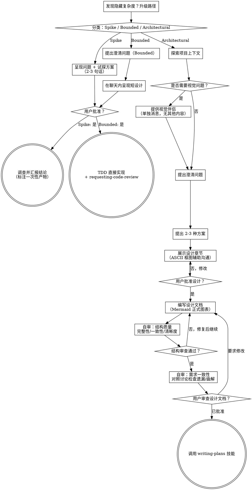

# 将创意转化为设计方案

通过自然的协作对话，将创意转化为完整的设计和规格文档。

**先分类，再动手：** 首先判断这个请求需要多少流程（Spike / Bounded / Architectural），然后沿所选路径走完——理解上下文、完善创意、呈现设计、获得用户批准。

## 建立共识理解

brainstorming 的产出，是**用户能认出来并纠正**的理解，而不是你单方面的假设。

1. **发现意图。** 从请求和现有上下文里找出：目标结果是什么、给谁用、怎样算成功。这些信息缺失时，**先问一个关于目的或用途的问题**，再谈功能或方案。知道应用类型 ≠ 知道用户为什么要它。补问缺失的需求，不等于让用户重新授权整个任务。
2. **回述你的理解。** 用一小段话写出目标结果、相关约束、成功标准，让用户能核对。**把「用户说过的」与「你假设的」分开列**——邀请纠正，把纠正吸收进来，然后才把它当作设计依据。
3. **把意图带进设计。** 把达成一致的理解保留在所选路径的产出里（Architectural 是书面 spec，Bounded / Spike 是聊天内设计或试探方案）。用它核对之后提出的每个功能与技术选择。

请求本身已含目的与约束时，**直接回述**，不要把同样的问题再问一遍。这段话要短——**它的准确性和可纠正性才是重点**。

<HARD-GATE>
采取任何实现动作之前——包括调用实现技能、编写产品代码、搭建脚手架、安装产品依赖、创建外部项目——必须完成所选路径的前置条件：

- **Spike**：用户批准问题与试探方案。
- **Bounded**：用户批准聊天内的短设计。
- **Architectural**：用户先审阅并批准书面 spec，再审阅书面实施计划并选择其执行方式。

**阶段级授权：** 一次回复只批准**当前正在呈现的那个阶段**。批准想法或功能范围，不等于批准还不存在的工件。

- 对话层批准 → 只允许写 spec 文件。
- 书面 spec 批准 → 才允许调用 writing-plans。

从最早未完成的阶段继续；不要把一个批准变成跳过所选路径其余步骤的许可。门控未完成时，只读的项目探索是允许的。
</HARD-GATE>

## 三条路径

开工前先分类，并把分类**说出口**——"这看起来是 Bounded，我在这里给一份短设计，不写 spec 文件"——让用户能推翻。

| 路径 | 判定条件 | 交互产出物 | 文档产出物 | 终点 |
|------|---------|-----------|-----------|------|
| **Spike** | 可行性问题（"能不能…"、"是否可能…"、"糙一点没关系"），产出是**答案**而非要保留的代码 | 问题 + 试探方案（2-3 句话） | 无 | 结论 + 标注一次性产物（不写文档、不留要保留的代码） |
| **Bounded** | 本仓库**已有流程**的小改动（加 flag、小端点、单文件修复）。判断依据是仓库里已有可直接读的流程——光知道应用类型不算 | 聊天内的短设计（几句话到几段） | 无 | TDD 直接实现 + requesting-code-review |
| **Architectural** | 新项目、新子系统、重构组件如何拼装、改动他人依赖的接口 | 分章节设计（ASCII 框图辅助） | `docs/superpowers/specs/YYYY-MM-DD-<topic>-design.md` | writing-plans → subagent-driven-development |

**Bounded 的边界：** bounded 衡量的是**仓库**，不是你的熟悉程度。没有现成流程可改的任务不是 bounded——新项目没有可读的流程，它是 architectural。

**三条硬规则：**

1. **分类必须说出口** — 开工前用一句话声明走哪条路径，让用户能推翻。
2. **怀疑时走重的那条** — 想用「这算 bounded」来跳过流程，本身就是怀疑的信号。
3. **只升不降** — 中途发现隐藏复杂度就停下、说明、升级路径；不允许降到轻路径。

## 反模式："这个太简单了，不需要批准"

每条路径都以用户在实现前批准所需设计告终。Bounded 改动可能只需聊天里的两句话（但仍需批准）；新建一个应用（哪怕只是待办清单）是 architectural，需要书面 spec 和计划交接。把工件规模缩放到所选路径，而不是跳过它。

## 反模式："纯文字就够了，不需要图"

复杂逻辑用纯文字描述，用户很难在脑中构建完整画面。架构怎么搭、页面怎么布局、数据怎么流动——用 ASCII 框图随手画出来，用户立刻能参与讨论。图不是文档装饰，是沟通工具。展示设计时不给图，等于让用户盲猜你的方案。

## Red Flags

| 念头 | 现实 |
|------|------|
| "这个太简单了，不需要设计" | 走所选路径：Bounded 给一份聊天短设计，Architectural 给书面 spec 与计划交接。 |
| "我把它算 bounded 免得走流程" | 用标签跳过工作本身就是怀疑的信号——走重的那条路径。 |
| "它是 bounded 而且设计很明显——边给边开工" | 门控是批准，不是设计的篇幅。先呈现，然后停下等 yes。 |
| "我熟悉这类应用，所以是 bounded" | Bounded 衡量仓库，不是你的熟悉程度。新项目没有现成流程——它是 architectural。 |
| "Spike 跑通了，代码就留下吧" | Spike 的产出是答案。保留代码是一个新请求——重新分类。 |
| "快做完了，就不用重新分类了" | 隐藏复杂度在中途升级路径。停下，说出来。 |
| "他们批准了 spike，后续改动也算批准了" | 每个任务有自己的分类和自己的批准。 |

## 检查清单

先分类、宣告路径，然后为**所选路径**的每一项创建任务并按顺序完成。

**Spike（5 步）：**

1. **探索项目上下文** — 足以框定试探方案即可
2. **呈现问题 + 试探方案** — 2-3 句话
3. **获得批准** — 点头即可
4. **调查** — 在保证正确的前提下尽可能廉价
5. **汇报结论** — 给出建议；凡构建出的东西一律标注为一次性产物

**Bounded（5 步）：**

1. **探索项目上下文** — 检查文件、文档、最近的提交
2. **提出澄清问题** — 一次一个，只问关键的
3. **在聊天内呈现短设计** — 方案、涉及文件、测试方式
4. **获得批准** — **停下来**等待明确的 yes；呈现设计与随即开工是同一个动作，等于跳过门控
5. **实现** — 走正常开发流程（TDD 适用），以 requesting-code-review 收尾；不写计划文档、不调用 writing-plans

**Architectural（10 步，现有完整流程）：**

1. **探索项目上下文** — 检查文件、文档、最近的提交
2. **提供视觉伴侣**（如果主题涉及视觉问题）— 这需要单独一条消息，不与澄清问题合并。请参阅下面的"视觉伴侣"部分。
3. **提出澄清问题** — 一次一个，理解目的/约束/成功标准
4. **提出 2-3 种方案** — 附上权衡分析和你的推荐
5. **展示设计（用 ASCII 图澄清）** — 按复杂度划分章节，用 ASCII 框图辅助沟通，每个章节获得用户批准（详见下方"展示设计"）
6. **编写设计文档** — 将设计方案 + Mermaid 正式图表 + 契约与接口写入 `docs/superpowers/specs/YYYY-MM-DD-<topic>-design.md` 并提交
7. **自审：结构质量** — 自己对照清单检查文档完整性、内部一致性、清晰度（详见下方"设计之后"）
8. **自审：需求一致性** — 对照原始讨论检查需求是否遗漏或曲解（见下文）
9. **用户审查设计文档** — 在继续前请用户审查设计文档文件
10. **过渡到实现** — 调用 writing-plans 技能创建实施计划

## 流程示意图

**终端状态由路径决定。** Architectural：头脑风暴之后唯一调用的技能是 writing-plans——不要调用 frontend-design、mcp-builder 或任何其他实现技能。Bounded：批准后直接走正常开发流程（TDD + requesting-code-review），不写计划文档。Spike：终端状态是汇报结论。

## 流程

以下小节服务于 Bounded 与 Architectural 路径（Spike 止步于"呈现试探方案、获得点头"）。从**探索方案**往后的深度——包括展示设计、ASCII → Mermaid 图表、"契约与接口"章节、设计文档——都属于 Architectural 路径。Bounded 只需上下文 + 几个关键问题 + 一份聊天短设计；它不写 spec 文件，「契约与接口」章节对它不适用。

**理解创意：**

- 首先查看当前项目状态（文件、文档、最近的提交）
- 在提出详细问题之前，评估范围：如果需求描述包含多个独立的子系统（例如，"构建一个包含聊天、文件存储、计费和分析的平台"），立即标记出来。不要花时间细化一个需要先拆解的项目细节。
- 如果项目太大无法放入单个规格，帮助用户拆分为子项目：有哪些独立模块，它们之间如何关联，应该按什么顺序构建？然后通过正常设计流程对第一个子项目进行头脑风暴。每个子项目都有自己的 设计文档 → 计划 → 实现 周期。
- 对于范围适当的项目，逐一提问以完善创意
- 尽量使用选择题，但开放式问题也可以
- 每条消息只提一个问题——如果一个主题需要更多探索，拆分成多个问题
- 重点理解：目的、约束、成功标准

**探索方案：**

- 提出 2-3 种不同方案，附上权衡分析
- 以对话方式呈现选项，给出你的推荐和理由
- 以你的推荐选项为先，并解释原因
- **严格 YAGNI**——从每个方案和设计里移除不必要的功能

**展示设计：用 ASCII 图澄清**

- 一旦你确信理解了要构建的内容，展示设计方案
- **用 ASCII 框图辅助沟通**——架构怎么搭、页面怎么布局、数据怎么流动，随手画出来，用户立刻能看图参与讨论
- 每个章节的篇幅根据其复杂程度调整：简单内容几句话，复杂内容可达到 200-300 字
- 每个章节后询问是否看起来正确
- 涵盖：架构、组件、数据流、错误处理、测试
- ASCII 框图追求快速、可改——这是和用户交互的工具，不是最终文档
- 如果某些内容不合理，随时准备返回去澄清

**ASCII → Mermaid 两阶段图表策略**：交互阶段用 ASCII 框图（随手画、可擦改），写设计文档时转 Mermaid（正式、可渲染）。选图规则、语法与示例见 [diagram-driven-design.md](diagram-driven-design.md)。

**隔离与清晰设计：**

- 将系统拆分为更小的单元，每个单元有一个清晰的职责，通过定义良好的接口通信，并且可以独立理解和测试
- 对于每个单元，你应该能够回答：它做什么、如何使用它、它依赖什么？
- 别人能否在不阅读内部实现的情况下理解一个单元的功能？你能否在不破坏使用者的情况下更改内部实现？如果不能，边界需要重新设计。
- 更小、边界清晰的单元也更容易让你处理——你更擅长推理能够同时放在上下文中的代码，当文件更专注时你的编辑也更可靠。当文件变得庞大时，通常表明它承担了过多职责。

**契约与接口（强制，并行基础）：**

模块之间的依赖本质上是对"接口/类型/契约"的依赖，而不是对"实现"的依赖。只要契约先定好，消费者和实现者就可以并行开发——**没有契约，writing-plans 无法判断哪些任务能并行**（否则会出现 A 叫 `getUser(id: string)`、B 叫 `getUser(id: number)` 这类冲突）。

Architectural 路径的设计文档必须包含「契约与接口」章节，定义以下内容：

**1. 共享类型：** 所有模块使用的公共类型定义（Domain Types、DTO、Props）。每个类型包含名称、字段、约束。

**2. 模块接口：** 每个模块对外暴露的接口签名。只定义签名，不写实现——实现是计划阶段的事。

**3. 跨端契约（前后端分离项目必填）：** API endpoint、请求/响应格式。

**4. 命名约定：** 文件命名、类命名、方法命名规则。所有实现者遵守同一套规则。

**5. 数据流图（Mermaid）：** 谁调谁、数据怎么走。用 flowchart 或 sequenceDiagram 表达。

接口表、跨端契约表与 classDiagram 示例见 [diagram-driven-design.md](diagram-driven-design.md)。

**在现有代码库中工作：**

- 在提议变更之前探索现有结构。遵循现有模式。
- 如果现有代码存在影响工作的问题（例如，文件变得过大、边界不清晰、职责混杂），将有针对性的改进纳入设计——就像优秀开发者会改进他们正在处理的代码一样。
- 不要提议无关的重构。专注于服务当前目标。

## 设计之后（Architectural 路径）

**文档化：**

- 将验证过的设计方案写入 `docs/superpowers/specs/YYYY-MM-DD-<topic>-design.md`
  - （用户对设计文档位置的偏好将覆盖此默认值）
- 交互阶段的 ASCII 框图转成 Mermaid 正式图表；契约用 classDiagram 表达（规范与示例见 [diagram-driven-design.md](diagram-driven-design.md)）
- 如果可用，使用 elements-of-style:writing-clearly-and-concisely 技能
- 将设计文档提交到 git

**自审一：结构质量**

设计文档提交后，对照下表自查——**这是一份你自己跑的清单，不派子代理**：

| 检查维度 | 检查内容 |
|---------|---------|
| 完整性 | 是否缺少项目类型对应的必备图表？Mermaid 语法是否正确？ |
| 内部一致性 | 各章节之间是否有矛盾？架构图是否与功能描述匹配？流程图是否覆盖了文字描述的所有路径？ |
| 清晰度 | 是否有需求可以被两种不同方式解读？ |

**自审二：需求一致性**

结构质量过后，对照原始讨论检查**需求是否被正确传达**：

1. **需求遗漏：** 讨论中用户确认过的需求点，文档是否全部覆盖？
2. **需求曲解：** 文档中的设计是否曲解了用户的本意？
3. **假设检查：** 文档里有哪些用户没说过但隐含的假设？是否应该标注出来？
4. **图表完整性：** 讨论中确定的 ASCII 概念是否都已转化为 Mermaid 正式图表？

内联修复所有问题。无需重新审查——修复后继续。

> **为什么自己跑就够：** 结构质量是文档的客观属性（矛盾、歧义、语法错误），作者视角就能验；需求一致性只有全程在场的人能验，而全程在场的就是你。**真正独立的视角留给用户门控**——那是最后一道，也是最有效的一道。

**用户审查门控（强制阻断）：**
设计文档自审循环通过后，**你必须停下来等待用户确认**才能继续：

> "设计文档已写入 `<路径>`。请审阅这份设计文档，是否有需要修改的地方？确认无误后我们再进入实施计划阶段。"

这是强制阻断，也是**阶段级授权**的分界点：对话层批准只允许写 spec 文件；只有用户明确确认**书面 spec** 之后，才允许调用 writing-plans。
如果用户要求修改，进行修改，重新运行设计文档自审，然后再次呈现。
重复直到用户明确确认设计文档正确。

**实现：**

- 调用 writing-plans 技能创建详细的实施计划
- 禁止调用任何其他技能。writing-plans 是下一步。

## 视觉伴侣

一个基于浏览器的伴侣工具，用于在头脑风暴期间展示模拟图、示意图和视觉选项。作为一个工具提供——而非一种模式。接受伴侣意味着在需要视觉处理的问题上可以使用它；但并不意味着每个问题都要通过浏览器。

**提供伴侣：** 当你预计即将提出的问题将涉及视觉内容（模拟图、布局、示意图）时，提供一次征求同意：

> "我们正在处理的某些内容如果我能通过网页浏览器展示给您，可能会更容易解释。我可以随时制作模拟图、示意图、对比图和其他视觉材料。这个功能还比较新，可能会消耗较多 token。想试试吗？（需要打开本地 URL）"

**此邀请必须是一条单独的消息。** 不要将其与澄清问题、上下文总结或任何其他内容合并。消息中应仅包含上述邀请内容，别无其他。在继续之前等待用户的回复。如果用户拒绝，继续进行纯文本的头脑风暴。

**每个问题的决策：** 即使在用户接受后，也要为每个问题决定是否使用浏览器或终端。判断标准：**用户通过看到它比读到它更能理解吗？**

- **使用浏览器** 处理本身就是视觉的内容——模拟图、线框图、布局对比、架构示意图、并排视觉设计
- **使用终端** 处理文本内容——需求问题、概念选择、权衡列表、A/B/C/D 文本选项、范围决策

关于 UI 主题的问题并不自动是视觉问题。"在这个上下文中，个性是什么意思？"是一个概念性问题——使用终端。"哪种向导布局更好？"是一个视觉问题——使用浏览器。

如果用户同意使用伴侣，在继续之前阅读详细指南：
`skills/brainstorming/visual-companion.md`
