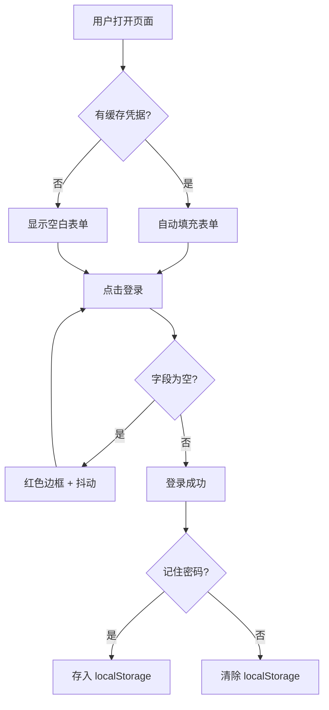
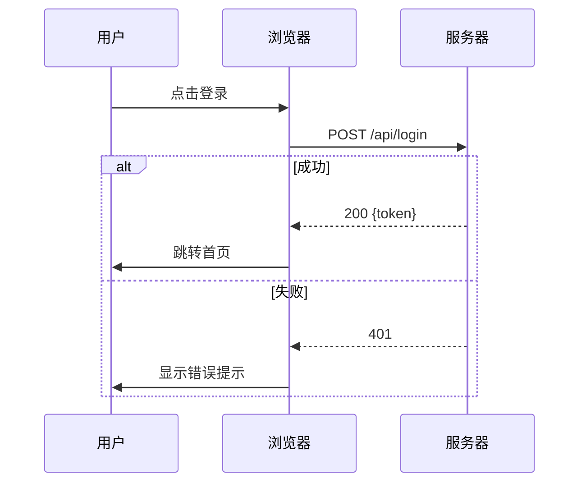
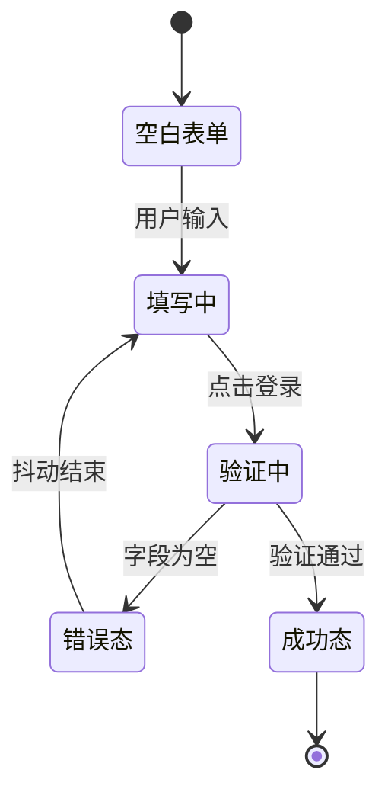
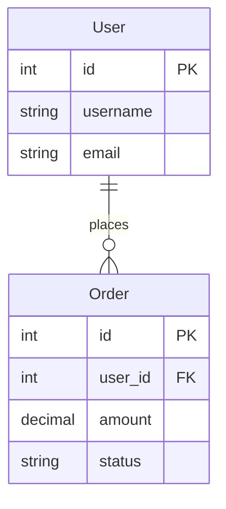

# 图表驱动设计规范

ASCII 框图 + Mermaid 图表的语法规范和示例。

## 选图规则

怎么摆、怎么连 → ASCII 框图。怎么走、怎么变 → Mermaid。

## ASCII 框图

框线字符：`─ │ ┌ ┐ └ ┘ ├ ┤ ┬ ┴ ┼`

### UI 布局原型

每个页面必须有一张。标注核心交互区域。多状态 UI 画出关键状态差异。

```
┌─────────────────────────────────────────┐
│            ⚡ 系统登录                    │
├─────────────────────────────────────────┤
│                                          │
│  ┌─ 用户名 ──────────────────────────┐  │
│  │ 请输入用户名                        │  │
│  └────────────────────────────────────┘  │
│                                          │
│  ┌─ 密码 ────────────────────────────┐  │
│  │ ••••••••                   👁️     │  │
│  └────────────────────────────────────┘  │
│                                          │
│  ☐ 记住密码                              │
│  ┌────────────────────────────────────┐  │
│  │            登  录                   │  │
│  └────────────────────────────────────┘  │
│                                          │
│  还没有账号？立即注册 →                   │
└─────────────────────────────────────────┘
```

### 架构图

标注模块名、端口、数据流向。箭头表达调用方向。

```
┌──────────────┐     ┌──────────────┐     ┌──────────────┐
│   API        │────▶│   用户服务    │────▶│   PostgreSQL │
│   Gateway    │     │   :3001      │     │  用户库       │
│   :8080      │     └──────┬───────┘     └──────────────┘
└──────┬───────┘            │
       │            ┌───────┴───────┐     ┌──────────────┐
       └───────────▶│   订单服务     │────▶│   PostgreSQL │
                    │   :3002      │     │  订单库       │
                    └───────────────┘     └──────────────┘
```

### 组件树

层级缩进表达包含/依赖关系。

```
App
├── Header
│   ├── Logo
│   └── NavMenu
├── Main
│   └── Router
│       ├── HomePage
│       └── AboutPage
└── Footer
```

## Mermaid 图表

直接嵌入 markdown 代码块，GitHub 原生渲染。

### flowchart

覆盖正常路径 + 异常分支 + 边界条件。



### sequenceDiagram

标注参与者和消息方向。覆盖成功和失败分支。



### stateDiagram

覆盖所有关键状态和转换条件。



### erDiagram

实体、字段、关系。


