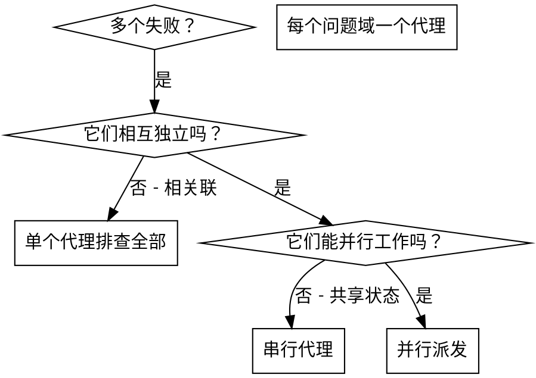

# 派发并行代理

## 概述

你把任务派发给拥有隔离上下文的专用代理。通过精确构造它们的指令与上下文，你确保它们保持专注、把任务做成。它们绝不继承你会话的上下文或历史——它们需要什么，由你精确构造。这也为你自己保留了用于协调工作的上下文。

当你有多个互不相关的失败（不同的测试文件、不同的子系统、不同的 bug）时，逐个串行排查是浪费时间。每次排查都相互独立，可以并行发生。

**核心原则：** 每个独立问题域派发一个代理。让它们并发工作。

## 何时使用



**在以下情况使用：**
- 3 个以上测试文件因不同根因失败
- 多个子系统各自独立损坏
- 每个问题无需其他问题的上下文即可理解
- 各次排查之间没有共享状态

**在以下情况不要使用：**
- 失败之间相互关联（修好一个可能连带修好其他）
- 需要理解整个系统状态
- 代理之间会互相干扰

## 该模式

### 1. 识别相互独立的域

按"坏了什么"对失败分组：
- 文件 A 的测试：工具审批流程
- 文件 B 的测试：批量完成行为
- 文件 C 的测试：中止功能

每个域都是独立的——修复工具审批不影响中止相关测试。

### 2. 创建聚焦的代理任务

每个代理得到：
- **明确范围：** 一个测试文件或子系统
- **清晰目标：** 让这些测试通过
- **约束：** 不要改动其他代码
- **期望输出：** 你发现并修复了什么的摘要

### 3. 并行派发

在同一条回复里发出全部三次派发。它们并行运行：

```text
子代理（general-purpose）："修复 agent-tool-abort.test.ts 的失败"
子代理（general-purpose）："修复 batch-completion-behavior.test.ts 的失败"
子代理（general-purpose）："修复 tool-approval-race-conditions.test.ts 的失败"
```

**一条回复里多次派发调用 = 并行执行。一条回复一次 = 串行。**

### 4. 审查与集成

代理返回时：
- 读每份摘要
- 核对各修复互不冲突
- 运行全量测试套件
- 集成全部改动
- 抽查——代理会犯系统性错误

## 代理 Prompt 结构

好的代理 prompt 是：
1. **聚焦** - 一个清晰的问题域
2. **自包含** - 理解问题所需的全部上下文
3. **对输出有具体要求** - 代理应当返回什么？

```markdown
修复 src/agents/agent-tool-abort.test.ts 中 3 个失败的测试：

1. "should abort tool with partial output capture" - 期望消息里出现 'interrupted at'
2. "should handle mixed completed and aborted tools" - 快速工具被中止而不是完成
3. "should properly track pendingToolCount" - 期望 3 个结果却得到 0

这些是时序/竞态条件问题。你的任务：

1. 读测试文件，理解每个测试验证什么
2. 定位根因 - 是时序问题还是真正的 bug？
3. 通过以下方式修复：
   - 把任意超时替换为基于事件的等待
   - 如发现中止实现里的 bug 就修掉
   - 如果测试针对的是已变化的行为，调整测试期望

不要只是调大超时 - 找到真正的问题。

返回：你发现并修复了什么的摘要。
```

## 常见错误

**❌ 太宽泛：** "修复所有测试" - 代理会迷失
**✅ 具体：** "修复 agent-tool-abort.test.ts" - 范围聚焦

**❌ 没有上下文：** "修复竞态条件" - 代理不知道在哪儿
**✅ 上下文：** 粘贴错误消息与测试名

**❌ 没有约束：** 代理可能重构一切
**✅ 约束：** "不要改动生产代码" 或 "只修测试"

**❌ 输出含糊：** "修一下" - 你不知道改了什么
**✅ 具体：** "返回根因与改动的摘要"

## 何时不使用

**失败相关联：** 修好一个可能连带修好其他——先一起排查
**需要完整上下文：** 理解问题必须看到整个系统
**探索性调试：** 你还不知道哪里坏了
**共享状态：** 代理会互相干扰（编辑同一批文件、使用同一份资源）

## 来自真实会话的示例

**场景：** 一次大重构之后，3 个文件里出现 6 个测试失败

**失败情况：**
- agent-tool-abort.test.ts：3 个失败（时序问题）
- batch-completion-behavior.test.ts：2 个失败（工具没有执行）
- tool-approval-race-conditions.test.ts：1 个失败（执行次数 = 0）

**判定：** 域相互独立——中止逻辑、批量完成、竞态条件三者彼此分离

**派发：**
```
代理 1 → 修复 agent-tool-abort.test.ts
代理 2 → 修复 batch-completion-behavior.test.ts
代理 3 → 修复 tool-approval-race-conditions.test.ts
```

**结果：**
- 代理 1：把超时替换为基于事件的等待
- 代理 2：修复事件结构 bug（threadId 放错位置）
- 代理 3：增加了对异步工具执行完成的等待

**集成：** 所有修复彼此独立、无冲突，全量套件通过

**节省的时间：** 3 个问题并行解决，而非串行
