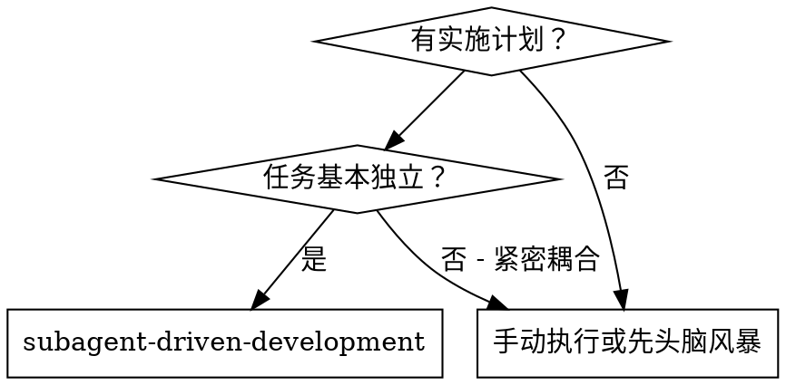

# 子代理驱动开发

通过为每个任务派发全新的子代理来执行计划，每个任务后进行两阶段审查：先任务合规审查，再代码质量审查。

**为什么用子代理：** 你将任务委托给具有隔离上下文的专业代理。通过精确构建他们的指令和上下文，确保他们保持专注并在任务中取得成功。他们不应继承你会话的上下文或历史——你精确构建他们需要的内容。这也为你保留了自己的上下文用于协调工作。

**核心原则：** 每个任务全新子代理 + 两阶段审查（先任务合规再代码质量）= 高质量、快速迭代

**连续执行：** 不要在任务之间停下来与你的用户伙伴确认。不间断地执行计划中的所有任务。唯一需要停止的情况是：你无法解决的 BLOCKED 状态、真正阻碍进展的歧义、或所有任务完成。"我该继续吗？"这类提示和进度摘要浪费他们的时间——他们要求你执行计划，那就执行。

## 前置条件

**实施计划必须已被用户明确确认**，才能调用此技能。如果你是控制器且用户尚未批准计划，禁止开始执行。应改为请用户先审阅并确认计划。

## 何时使用



## 完整工作流（含上游门控）

```dot
digraph full_workflow {
    rankdir=TB;

    subgraph cluster_brainstorming {
        label="1. brainstorming（需求梳理）";
        "探索 + 澄清 + 设计" [shape=box];
        "写入设计文档到 docs/superpowers/specs/" [shape=box];
        "设计文档自审" [shape=box];
        "用户审阅设计文档？" [shape=diamond];
        "修改设计文档" [shape=box];
        "用户确认设计文档 ✅" [shape=box style=filled fillcolor=lightgreen];
    }

    subgraph cluster_writing_plans {
        label="2. writing-plans（任务分解）";
        "将设计文档拆分为任务" [shape=box];
        "写入计划到 docs/superpowers/plans/" [shape=box];
        "计划自审" [shape=box];
        "用户审阅计划？" [shape=diamond];
        "修改计划" [shape=box];
        "用户确认计划 ✅" [shape=box style=filled fillcolor=lightgreen];
    }

    subgraph cluster_execution {
        label="3. subagent-driven-development（子代理执行）";
        "读取计划，提取所有任务，创建 TodoWrite" [shape=box];

        subgraph cluster_per_task {
            label="每个任务";
            "派发实现者子代理" [shape=box];
            "实现者：TDD、测试、提交、自审" [shape=box];
            "派发任务合规审查员子代理" [shape=box];
            "任务合规？" [shape=diamond];
            "SendMessage：实现者修复" [shape=box];
            "派发代码质量审查员子代理" [shape=box];
            "质量通过？" [shape=diamond];
            "SendMessage：实现者修复" [shape=box];
            "标记任务完成 + 更新计划 checkbox" [shape=box];
        }

        "还有剩余任务？" [shape=diamond];
    }

    subgraph cluster_finish {
        label="4-5. 审查 + 收尾";
        "requesting-code-review（整体审查）" [shape=box];
        "finishing-a-development-branch" [shape=box style=filled fillcolor=lightgreen];
    }

    "探索 + 澄清 + 设计" -> "写入设计文档到 docs/superpowers/specs/";
    "写入设计文档到 docs/superpowers/specs/" -> "设计文档自审";
    "设计文档自审" -> "用户审阅设计文档？";
    "用户审阅设计文档？" -> "修改设计文档" [label="需要修改"];
    "修改设计文档" -> "写入设计文档到 docs/superpowers/specs/";
    "用户审阅设计文档？" -> "用户确认设计文档 ✅" [label="已批准"];

    "用户确认设计文档 ✅" -> "将设计文档拆分为任务";
    "将设计文档拆分为任务" -> "写入计划到 docs/superpowers/plans/";
    "写入计划到 docs/superpowers/plans/" -> "计划自审";
    "计划自审" -> "用户审阅计划？";
    "用户审阅计划？" -> "修改计划" [label="需要修改"];
    "修改计划" -> "写入计划到 docs/superpowers/plans/";
    "用户审阅计划？" -> "用户确认计划 ✅" [label="已批准"];

    "用户确认计划 ✅" -> "读取计划，提取所有任务，创建 TodoWrite";

    "读取计划，提取所有任务，创建 TodoWrite" -> "派发实现者子代理";
    "派发实现者子代理" -> "实现者：TDD、测试、提交、自审";
    "实现者：TDD、测试、提交、自审" -> "派发任务合规审查员子代理";
    "派发任务合规审查员子代理" -> "任务合规？";
    "任务合规？" -> "SendMessage：实现者修复" [label="否"];
    "SendMessage：实现者修复" -> "派发任务合规审查员子代理" [label="重新审查"];
    "任务合规？" -> "派发代码质量审查员子代理" [label="是"];
    "派发代码质量审查员子代理" -> "质量通过？";
    "质量通过？" -> "SendMessage：实现者修复" [label="否"];
    "SendMessage：实现者修复" -> "派发代码质量审查员子代理" [label="重新审查"];
    "质量通过？" -> "标记任务完成 + 更新计划 checkbox" [label="是"];
    "标记任务完成 + 更新计划 checkbox" -> "还有剩余任务？";
    "还有剩余任务？" -> "派发实现者子代理" [label="是"];
    "还有剩余任务？" -> "requesting-code-review（整体审查）" [label="否"];
    "requesting-code-review（整体审查）" -> "finishing-a-development-branch";
}
```



## 计划文件跟踪

在 TodoWrite 中标记任务完成后，**立即使用 Edit 工具更新计划文件**：
- 将任务的 checkbox 从 `- [ ]` 改为 `- [x]`
- 这提供了超越会话范围的持久化进度跟踪

## 两阶段审查（必须派发子代理）

**控制器必须为所有审查和修复派发全新的子代理。绝不在控制器会话中审查或修复。**

实现者报告 DONE 或 DONE_WITH_CONCERNS 后：

### 第一阶段：任务合规审查
1. **派发任务合规审查员子代理**，使用 `./task-reviewer-prompt.md`
   - 提供：(a) 计划中的完整任务内容（目标 + 验收标准 + 测试用例 + 设计文档索引）
   - 设计文档索引是文件路径 + 章节——任务合规审查员按需读取，而非预先加载
2. 等待审查员裁决
3. 如果 ❌ 发现问题 → **SendMessage** 给实现者子代理并附带审查员的问题 → **派发新的任务合规审查员子代理**
4. 如果 ✅ 合规 → 进入第二阶段

### 第二阶段：代码质量审查
1. **派发代码质量审查员子代理**，使用 `./code-quality-reviewer-prompt.md`
2. 等待审查员裁决
3. 如果发现问题 → **SendMessage** 给实现者子代理并附带审查员的问题 → **派发新的代码质量审查员子代理**
4. 如果 ✅ 通过 → 标记任务完成

**关键派发规则：**
- **实现者修复：** 使用 `SendMessage` 继续同一个实现者子代理（它拥有实现上下文）。绝不要为修复派发新的实现者。
- **审查员重新检查：** 每次派发新的审查员子代理（全新上下文，不受之前审查的偏见影响）。
- **控制器：** 只读取子代理报告并决定派发动作。绝不自己读代码或写修复。

**控制器的角色仅是协调者：**
- 实现者 = 子代理（实现 + 修复）
- 任务合规审查员 = 子代理（检查任务合规性）
- 代码质量审查员 = 子代理（检查代码质量）
- 控制器 = 只派发子代理、读取他们的报告、决定下一步

**为什么控制器不能自己审查或修复：**
- 控制器拥有完整会话上下文，已被实现决策偏见化
- 审查员需要全新、隔离的上下文来发现实现者遗漏的内容
- 在控制器中修复会污染其上下文与实现细节
- 自我审查违背了两阶段质量门控的目的

**绝对禁止：**
- 在控制器会话中阅读实现者代码并判断任务合规性
- 自己修复代码——始终重新派发实现者子代理
- 跳过派发审查员子代理以"节省时间"
- 在未获得每个审查员子代理的明确 ✅ 裁决前继续
- **在任务合规审查通过之前开始代码质量审查**（顺序错误）
- 在任一审查有未解决问题时进入下一个任务
- **在控制器会话中审查任务或代码质量**——始终派发审查员子代理

## 模型选择

使用每个角色能胜任的最弱模型以节省成本并提高速度。

**机械实现任务**（独立函数、清晰的规格、1-2 个文件）：使用快速、便宜的模型。当计划编写良好时，大多数实现任务都是机械的。

**集成和判断任务**（多文件协调、模式匹配、调试）：使用标准模型。

**架构、设计和审查任务**：使用最强可用的模型。

**任务复杂度信号：**
- 涉及 1-2 个文件且有完整设计文档 → 便宜模型
- 涉及多个文件且有集成关注点 → 标准模型
- 需要设计判断或广泛的代码库理解 → 最强模型

## 处理实现者状态

实现者子代理报告以下四种状态之一。恰当地处理每种：

**DONE：** 派发任务合规审查员子代理（见下方两阶段审查）。

**DONE_WITH_CONCERNS：** 实现者完成了工作但标记了疑虑。在继续之前阅读这些顾虑。如果顾虑是关于正确性或范围的，在审查之前解决它们。如果是观察性意见（例如"这个文件变大了"），记录下来并继续审查。

**NEEDS_CONTEXT：** 实现者需要未提供的信息。提供缺失的上下文并重新派发。

**BLOCKED：** 实现者无法完成任务。评估阻碍：
1. 如果是上下文问题，提供更多上下文并用相同模型重新派发
2. 如果任务需要更多推理，用更强的模型重新派发
3. 如果任务太大，将其拆分为更小的部分
4. 如果计划本身有问题，升级给用户

**绝对不要**忽略升级或用相同模型不做任何改变就重试。如果实现者说卡住了，就需要改变什么。

## Prompt 模板

- `./implementer-prompt.md` — 派发实现者子代理
- `./task-reviewer-prompt.md` — 派发任务合规审查员子代理
- `./code-quality-reviewer-prompt.md` — 派发代码质量审查员子代理

## 示例工作流

```
你：我正在使用子代理驱动开发来执行此计划。

[读取计划文件：docs/superpowers/plans/feature-plan.md]
[提取所有 5 个任务：目标、验收标准、测试用例、设计文档索引、文件路径]
[创建包含所有任务的 TodoWrite]

Task 1：Hook 安装脚本

[获取 Task 1 的目标、验收标准、测试用例（已提取）]
[派发实现子代理，附带任务内容 + 上下文]

实现者："开始之前——hook 应该安装在用户级别还是系统级别？"

你："用户级别（~/.config/superpowers/hooks/）"

实现者："明白了。正在实现……"
[稍后] 实现者：
  - 实现了 install-hook 命令
  - 添加了测试，5/5 通过
  - 自审：发现遗漏了 --force 标志，已添加
  - 已提交

[派发任务合规审查员，附带 Task 1 需求 + 设计文档索引]
任务合规审查员：✅ 任务合规——所有需求已满足，无多余内容

[获取 git SHA，派发代码质量审查员]
代码审查员：优点：测试覆盖好，代码整洁。问题：无。已批准。

[标记 Task 1 完成 + Edit 计划文件 - [x]]

Task 2：恢复模式

[获取 Task 2 的目标、验收标准、测试用例（已提取）]
[派发实现子代理，附带任务内容 + 上下文]

实现者：[无问题，继续]
实现者：
  - 添加了 verify/repair 模式
  - 8/8 测试通过
  - 自审：一切良好
  - 已提交

[派发任务合规审查员]
任务合规审查员：❌ 问题：
  - 缺失：进度报告（任务要求"每 100 条报告一次"）
  - 多余：添加了 --json 标志（未要求）

[实现者修复问题]
实现者：移除了 --json 标志，添加了进度报告

[任务合规审查员重新审查]
任务合规审查员：✅ 现在任务合规

[派发代码质量审查员]
代码审查员：优点：扎实。问题（重要）：魔法数字（100）

[实现者修复]
实现者：提取了 PROGRESS_INTERVAL 常量

[代码审查员重新审查]
代码审查员：✅ 已批准

[标记 Task 2 完成]

……

[所有任务完成后]
[使用 superpowers:requesting-code-review 进行整体审查]
最终审查员：所有需求已满足，可以合并

完成！
```

## 优势

**对比手动执行：**
- 子代理自然遵循 TDD
- 每个任务全新上下文（不会混淆）
- 并行安全（子代理不互相干扰）
- 子代理可以提问（工作前和工作期间）

**效率增益：**
- 无文件读取开销（控制器提供验收标准 + 文件路径）
- 控制器精确构建所需上下文
- 子代理预先获得验收标准，独立实现
- 问题在工作开始前被提出（而非之后）

**质量门控：**
- 自审在交接前发现问题
- 两阶段审查：先任务合规，再代码质量
- 审查循环确保修复真正有效
- 任务合规审查防止过度/不足构建
- 代码质量审查确保实现质量良好

**成本：**
- 更多的子代理调用（每个任务：实现者 + 2 个审查员）
- 控制器做更多准备工作（预先提取所有任务）
- 审查循环增加迭代次数
- 但早期发现问题（比后期调试更便宜）

## 红线

**绝对禁止：**
- 未经用户明确同意在 main/master 分支上开始实现
- 跳过审查（任务合规或代码质量任一）
- 带着未修复的问题继续
- 并行派发多个实现子代理（会冲突）
- 让子代理读计划文件（改为提供完整文本）
- 跳过场景设置上下文（子代理需要理解任务在整体中的位置）
- 忽略子代理的问题（让他们继续之前先回答）
- 在任务合规审查中接受"差不多"（任务合规审查员发现问题 = 没做完）
- 跳过审查循环（审查员发现问题 = 实现者修复 = 再次审查）
- 让实现者自审替代实际审查（两者都需要）
- **在任务合规审查通过之前开始代码质量审查**（顺序错误）
- 在任一审查有未解决问题时进入下一个任务
- **在控制器会话中审查任务或代码质量**——始终派发审查员子代理

**如果子代理提问：**
- 清晰完整地回答
- 如果需要，提供额外上下文
- 不要催促他们进入实现

**如果审查员发现问题：**
- 实现者（同一子代理）修复它们
- 审查员再次审查
- 重复直到通过
- 不要跳过重新审查

**如果子代理任务失败：**
- 派发修复子代理并附带具体指令
- 不要尝试手动修复（上下文污染）

## 集成

**必需的工作流技能：**
- **superpowers:using-git-worktrees** — 确保隔离的工作空间（创建一个或验证已有的）
- **superpowers:writing-plans** — 创建此技能执行的计划
- **superpowers:requesting-code-review** — 为审查员子代理提供代码审查模板
- **superpowers:finishing-a-development-branch** — 所有任务完成后完成开发

**子代理应使用：**
- **superpowers:test-driven-development** — 子代理为每个任务遵循 TDD

**替代工作流：**
- 无（subagent-driven-development 是唯一的执行技能）
