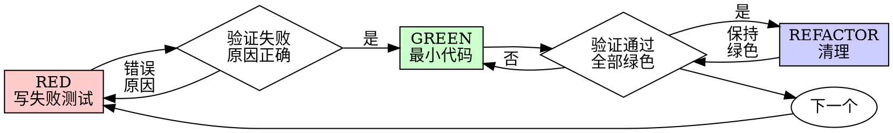

# 测试驱动开发（TDD）

## 概述

先写测试。看它失败。写最小代码使其通过。

**核心原则：** 没亲眼看到测试失败，就不知道它是否测试了正确的东西。

**违反字面规则就是违反精神规则。**

## 何时使用

**始终：**
- 新功能
- Bug 修复
- 重构
- 行为变更

**例外（先问你的用户伙伴）：**
- 一次性原型
- 生成的代码
- 配置文件

想着"就这一次跳过 TDD"？停。这是自我合理化。

## 铁律

```
没有先写失败的测试，就没有生产代码
```

测试前写了代码？删掉。重来。

**没有例外：**
- 不要留作"参考"
- 不要在写测试时"调整"它
- 不要看它
- 删就是删

从测试全新实现。没有商量余地。

## Red-Green-Refactor



### RED — 写失败测试

写一个最小测试展示应该发生什么。

<Good>
```typescript
test('retries failed operations 3 times', async () => {
  let attempts = 0;
  const operation = () => {
    attempts++;
    if (attempts < 3) throw new Error('fail');
    return 'success';
  };

  const result = await retryOperation(operation);

  expect(result).toBe('success');
  expect(attempts).toBe(3);
});
```
名称清晰，测试真实行为，只测一件事
</Good>

<Bad>
```typescript
test('retry works', async () => {
  const mock = jest.fn()
    .mockRejectedValueOnce(new Error())
    .mockRejectedValueOnce(new Error())
    .mockResolvedValueOnce('success');
  await retryOperation(mock);
  expect(mock).toHaveBeenCalledTimes(3);
});
```
名称模糊，测的是 mock 不是代码
</Bad>

**要求：**
- 一个行为
- 名称清晰
- 真实代码（除非无法避免，不用 mock）

### 验证 RED — 看着它失败

**强制。绝不跳过。**

```bash
npm test path/to/test.test.ts
```

确认：
- 测试失败（不是报错）
- 失败消息符合预期
- 失败原因是功能缺失（不是拼写错误）

**测试通过了？** 说明在测已有行为。修正测试。

**测试报错了？** 修错误，重新运行直到正确失败。

### GREEN — 最小代码

写最简单的代码使测试通过。

<Good>
```typescript
async function retryOperation<T>(fn: () => Promise<T>): Promise<T> {
  for (let i = 0; i < 3; i++) {
    try {
      return await fn();
    } catch (e) {
      if (i === 2) throw e;
    }
  }
  throw new Error('unreachable');
}
```
刚好够通过
</Good>

<Bad>
```typescript
async function retryOperation<T>(
  fn: () => Promise<T>,
  options?: {
    maxRetries?: number;
    backoff?: 'linear' | 'exponential';
    onRetry?: (attempt: number) => void;
  }
): Promise<T> {
  // YAGNI
}
```
过度设计
</Bad>

不要加功能、不要重构其他代码、不要"改进"测试之外的东西。

### 验证 GREEN — 看着它通过

**强制。**

```bash
npm test path/to/test.test.ts
```

确认：
- 测试通过
- 其他测试仍然通过
- 输出干净（无错误、无警告）

**测试失败？** 修代码，不是修测试。

**其他测试失败？** 立刻修。

### REFACTOR — 清理

只在通过之后：
- 消除重复
- 改进命名
- 提取辅助函数

保持测试绿色。不要加行为。

### 重复

下一个失败测试对应下一个功能。

## 好测试

| 质量 | 好 | 坏 |
|------|-----|-----|
| **最小** | 一件事。名称里含"和"？拆开。 | `test('验证邮箱和域名和空格')` |
| **清晰** | 名称描述行为 | `test('test1')` |
| **展示意图** | 演示期望的 API | 隐藏代码应该做什么 |

## 为什么顺序重要

**"我写完后再加测试来验证"**

代码之后写的测试立刻通过。立刻通过什么也证明不了：
- 可能测了错误的东西
- 可能测了实现而非行为
- 可能漏了你忘记的边界情况
- 你从未看到它捕获 bug

测试先行强迫你看到测试失败，证明它确实测了某些东西。

**"我已经手动测试了所有边界情况"**

手动测试是临时的。你以为全测了但：
- 没有测试记录
- 代码变更时无法重新运行
- 压力下容易忘记用例
- "我当时试了能用" ≠ 全面

自动化测试是系统化的。每次都一样运行。

**"删掉 X 小时的工作太浪费"**

沉没成本谬误。时间已经没了。现在的选择是：
- 删掉用 TDD 重写（X 小时，高信心）
- 保留然后事后加测试（30 分钟，低信心，可能 bug）

"浪费"的是保留你不能信任的代码。没有真测试的工作代码是技术债。

**"TDD 太教条，务实意味着灵活"**

TDD 就是务实：
- 提交前发现 bug（比事后调试快）
- 防止回归（测试立刻捕捉破坏）
- 文档化行为（测试展示如何使用代码）
- 支持重构（随意改，测试捕捉破坏）

"务实"的捷径 = 生产环境调试 = 更慢。

**"事后测试达到同样目标——这是精神不是仪式"**

不对。事后测试回答"这个做什么？"先写测试回答"这个应该做什么？"

事后测试被你的实现偏见化。你测你构建的东西，不是需求。你验证记住的边界情况，不是发现的。

测试先行强迫在实现前发现边界情况。事后测试验证你记住了所有东西（你没有）。

事后 30 分钟测试 ≠ TDD。你有了覆盖率，丢了测试有效的证明。

## 常见合理化

| 借口 | 现实 |
|------|------|
| "太简单不值得测" | 简单代码也会坏。测试只要 30 秒。 |
| "回头再加测试" | 立刻通过的测试什么也证明不了。 |
| "事后测试达到同样目标" | 事后="这个做什么？" 事先="这个应该做什么？" |
| "已经手动测过了" | 临时 ≠ 系统化。无记录，不能重跑。 |
| "删掉 X 小时太浪费" | 沉没成本谬误。保留未验证代码是技术债。 |
| "留着参考，先写测试" | 你会调整它。那就是事后测试。删就是删。 |
| "需要先探索" | 可以。扔掉探索结果，用 TDD 开始。 |
| "难测 = 设计不清" | 听测试的。难测 = 难用。 |
| "TDD 会拖慢我" | TDD 比调试快。务实 = 测试先行。 |
| "手动测试更快" | 手动不证明边界情况。每次改动都要重新测试。 |
| "已有代码没测试" | 你在改进它。为已有代码加测试。 |

## 红旗 — 停止重来

- 测试前写了代码
- 实现之后加测试
- 测试立刻通过
- 解释不了测试为什么失败
- 测试"回头再加"
- 合理化"就这一次"
- "我已经手动测过了"
- "事后测试达到同样目的"
- "这是精神不是仪式"
- "留着参考"或"调整已有代码"
- "已经花了 X 小时，删掉浪费"
- "TDD 太教条，我很务实"
- "这次不一样因为……"

**所有这些意味着：删除代码。用 TDD 重来。**

## 示例：Bug 修复

**Bug：** 空邮箱被接受

**RED**
```typescript
test('rejects empty email', async () => {
  const result = await submitForm({ email: '' });
  expect(result.error).toBe('Email required');
});
```

**验证 RED**
```bash
$ npm test
FAIL: expected 'Email required', got undefined
```

**GREEN**
```typescript
function submitForm(data: FormData) {
  if (!data.email?.trim()) {
    return { error: 'Email required' };
  }
  // ...
}
```

**验证 GREEN**
```bash
$ npm test
PASS
```

**REFACTOR**
需要时提取验证逻辑处理多个字段。

## 验证检查清单

标记工作完成前：

- [ ] 每个新函数/方法有测试
- [ ] 实现前亲眼看到每个测试失败
- [ ] 每个测试失败原因正确（功能缺失，不是拼写错误）
- [ ] 为每个测试写最小代码使其通过
- [ ] 所有测试通过
- [ ] 输出干净（无错误、无警告）
- [ ] 测试使用真实代码（mock 仅用于无法避免的情况）
- [ ] 覆盖边界情况和错误

不能全勾上？你跳过了 TDD。重来。

## 卡住时

| 问题 | 解决方案 |
|------|---------|
| 不知道怎么测 | 写期望的 API。先写断言。问你的用户伙伴。 |
| 测试太复杂 | 设计太复杂。简化接口。 |
| 必须 mock 一切 | 代码耦合太紧。使用依赖注入。 |
| 测试 setup 巨大 | 提取辅助函数。仍然复杂？简化设计。 |

## 调试集成

发现 bug？写失败的测试复现它。走 TDD 循环。测试证明修复并防止回归。

绝不修复没有测试的 bug。

## 测试反模式

加 mock 或测试工具时，阅读 @testing-anti-patterns.md 避免常见陷阱：
- 测 mock 行为而非真实行为
- 给生产类加仅供测试的方法
- 不理解依赖就 mock

## 最终规则

```
生产代码 → 测试存在且先失败过
否则 → 不是 TDD
```

没有用户伙伴许可，没有例外。
