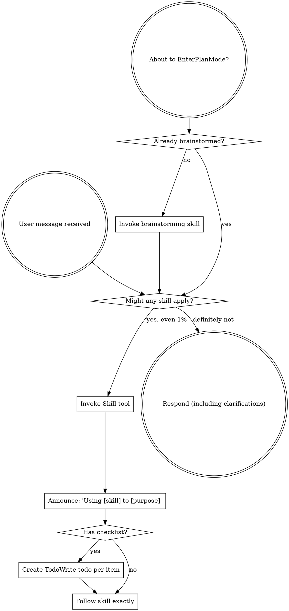

<SUBAGENT-STOP>
如果你是作为子代理被派发来执行特定任务，请跳过本技能。
</SUBAGENT-STOP>

<EXTREMELY-IMPORTANT>
即使你认为只有 1% 的可能性某个技能可能适用于你正在做的事情，你绝对必须调用该技能。

如果有技能适用于你的任务，你没有选择余地。你必须使用它。

这是不可协商的。这不是可选的。你无法为自己找借口开脱。
</EXTREMELY-IMPORTANT>

## 指令优先级

Superpowers 技能会覆盖默认的系统提示行为，但**用户指令始终优先**：

1. **用户的明确指令**（CLAUDE.md、GEMINI.md、AGENTS.md、直接请求）— 最高优先级
2. **Superpowers 技能** — 在发生冲突时覆盖默认系统行为
3. **默认系统提示** — 最低优先级

如果 CLAUDE.md、GEMINI.md 或 AGENTS.md 中写着"不要使用 TDD"，而某个技能说"始终使用 TDD"，则遵循用户的指令。用户拥有控制权。

## 如何访问技能

**在 Claude Code 中：** 使用 `Skill` 工具。当你调用某个技能时，其内容会被加载并呈现给你—直接遵循它。永远不要对技能文件使用 Read 工具。

**在 Copilot CLI 中：** 使用 `skill` 工具。技能会从已安装的插件中自动发现。`skill` 工具的工作方式与 Claude Code 的 `Skill` 工具相同。

**在 Gemini CLI 中：** 技能通过 `activate_skill` 工具激活。Gemini 在会话开始时加载技能元数据，并按需激活完整内容。

**在其他环境中：** 请查阅你所使用平台的文档，了解技能的加载方式。

## 平台适配

技能使用 Claude Code 的工具名称。非 CC 平台：请参阅 `references/copilot-tools.md`（Copilot CLI）、`references/codex-tools.md`（Codex）以了解工具对应关系。Gemini CLI 用户会通过 GEMINI.md 自动获得工具映射。

# 使用技能

## 规则

**在任何响应或操作之前，调用相关或被请求的技能。** 即使某个技能只有 1% 的可能性适用，也应调用该技能进行检查。如果调用的技能结果证明不适合当前情况，你不必使用它。

## 危险信号

这些想法意味着停下来——你正在为自己找借口：

| 想法 | 现实 |
|---------|---------|
| "这只是一个简单的问题" | 问题就是任务。检查是否有相关技能。 |
| "我需要先获取更多上下文" | 技能检查在澄清问题之前进行。 |
| "让我先探索一下代码库" | 技能会告诉你如何探索。先检查。 |
| "我可以快速查看一下 git/文件" | 文件缺乏对话上下文。检查是否有相关技能。 |
| "让我先收集一些信息" | 技能会告诉你如何收集信息。 |
| "这不需要正式的技能" | 如果存在相关技能，就使用它。 |
| "我记得这个技能" | 技能会不断演进。阅读当前版本。 |
| "这不算是一个任务" | 行动 = 任务。检查是否有相关技能。 |
| "这个技能有点大材小用" | 简单的事情会变得复杂。使用它。 |
| "我先做完这一件事" | 在做任何事之前先检查。 |
| "这感觉很有成效" | 无纪律的行动浪费时间。技能可以防止这种情况。 |
| "我知道那是什么意思" | 知道概念 ≠ 使用技能。调用它。 |

## 技能优先级

当多个技能都适用时，按以下顺序使用：

1. **首先使用流程类技能**（brainstorming、debugging）— 这些决定如何处理任务
2. **其次使用实现类技能**（frontend-design、mcp-builder）— 这些指导执行

"让我们构建 X" → 首先 brainstorming，然后是实现类技能。
"修复这个 bug" → 首先 debugging，然后是领域特定技能。

## 技能类型

**严格型**（TDD、debugging）：严格遵循。不要为了变通而放弃纪律。

**灵活型**（patterns）：根据上下文调整原则。

技能本身会告诉你它是哪种类型。

## 用户指令

指令说明的是"做什么"，而不是"怎么做"。"添加 X"或"修复 Y"并不意味着可以跳过工作流。
