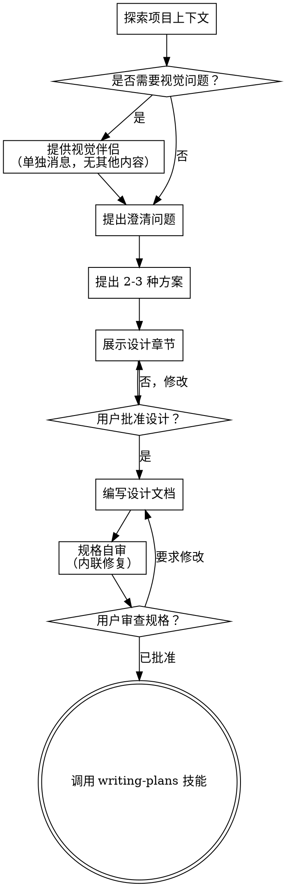

# 将创意转化为设计方案

通过自然的协作对话，将创意转化为完整的设计和规格说明书。

首先了解当前项目上下文，然后逐一提问以完善创意。一旦理解了要构建的内容，展示设计方案并获得用户批准。

<HARD-GATE>
在展示设计方案并获得用户批准之前，不得调用任何实现技能、编写任何代码、搭建任何项目或采取任何实施行动。此规则适用于每个项目，无论其看似多么简单。
</HARD-GATE>

## 反模式："这个太简单了，不需要设计"

每个项目都要经历这个过程。待办事项列表、单功能工具、配置变更——无一例外。"简单"的项目恰恰是未经检验的假设造成最多无用功的地方。设计可以很简短（对于真正简单的项目只需几句话），但你必须展示它并获得批准。

## 检查清单

你必须为以下每一项创建任务并按顺序完成：

1. **探索项目上下文** — 检查文件、文档、最近的提交
2. **提供视觉伴侣**（如果主题涉及视觉问题）— 这需要单独一条消息，不与澄清问题合并。请参阅下面的"视觉伴侣"部分。
3. **提出澄清问题** — 一次一个，理解目的/约束/成功标准
4. **提出 2-3 种方案** — 附上权衡分析和你的推荐
5. **展示设计** — 按复杂度划分章节，每个章节获得用户批准
6. **编写设计文档** — 保存到 `docs/superpowers/specs/YYYY-MM-DD-<topic>-design.md` 并提交
7. **规格自审** — 快速内联检查占位符、矛盾、歧义、范围（见下文）
8. **用户审查书面规格** — 在继续前请用户审查规格文件
9. **过渡到实现** — 调用 writing-plans 技能创建实施计划

## 流程示意图

**终端状态是调用 writing-plans。** 不要调用 frontend-design、mcp-builder 或任何其他实现技能。头脑风暴之后唯一调用的技能是 writing-plans。

## 流程

**理解创意：**

- 首先查看当前项目状态（文件、文档、最近的提交）
- 在提出详细问题之前，评估范围：如果需求描述包含多个独立的子系统（例如，"构建一个包含聊天、文件存储、计费和分析的平台"），立即标记出来。不要花时间细化一个需要先拆解的项目细节。
- 如果项目太大无法放入单个规格，帮助用户拆分为子项目：有哪些独立模块，它们之间如何关联，应该按什么顺序构建？然后通过正常设计流程对第一个子项目进行头脑风暴。每个子项目都有自己的规格 → 计划 → 实现周期。
- 对于范围适当的项目，逐一提问以完善创意
- 尽量使用选择题，但开放式问题也可以
- 每条消息只提一个问题——如果一个主题需要更多探索，拆分成多个问题
- 重点理解：目的、约束、成功标准

**探索方案：**

- 提出 2-3 种不同方案，附上权衡分析
- 以对话方式呈现选项，给出你的推荐和理由
- 以你的推荐选项为先，并解释原因

**展示设计：**

- 一旦你确信理解了要构建的内容，展示设计方案
- 每个章节的篇幅根据其复杂程度调整：简单内容几句话，复杂内容可达到 200-300 字
- 每个章节后询问是否看起来正确
- 涵盖：架构、组件、数据流、错误处理、测试
- 如果某些内容不合理，随时准备返回去澄清

**隔离与清晰设计：**

- 将系统拆分为更小的单元，每个单元有一个清晰的职责，通过定义良好的接口通信，并且可以独立理解和测试
- 对于每个单元，你应该能够回答：它做什么、如何使用它、它依赖什么？
- 别人能否在不阅读内部实现的情况下理解一个单元的功能？你能否在不破坏使用者的情况下更改内部实现？如果不能，边界需要重新设计。
- 更小、边界清晰的单元也更容易让你处理——你更擅长推理能够同时放在上下文中的代码，当文件更专注时你的编辑也更可靠。当文件变得庞大时，通常表明它承担了过多职责。

**在现有代码库中工作：**

- 在提议变更之前探索现有结构。遵循现有模式。
- 如果现有代码存在影响工作的问题（例如，文件变得过大、边界不清晰、职责混杂），将有针对性的改进纳入设计——就像优秀开发者会改进他们正在处理的代码一样。
- 不要提议无关的重构。专注于服务当前目标。

## 设计之后

**文档：**

- 将验证过的设计（规格）写入 `docs/superpowers/specs/YYYY-MM-DD-<topic>-design.md`
  - （用户对规格文件位置的偏好将覆盖此默认值）
- 如果可用，使用 elements-of-style:writing-clearly-and-concisely 技能
- 将设计文档提交到 git

**规格自审：**
编写规格文档后，以全新视角审视它：

1. **占位符扫描：** 是否有"待定"、"待办"、不完整的章节或模糊的需求？修复它们。
2. **内部一致性：** 是否有章节之间存在矛盾？架构是否与功能描述匹配？
3. **范围检查：** 是否足够聚焦以放入一个实施计划，还是需要拆解？
4. **歧义检查：** 是否有任何需求可以有两种不同的解释？如果有，选择一种并明确说明。

内联修复所有问题。无需重新审查——只需修复并继续。

**用户审查关卡：**
规格审查循环通过后，请用户审查书面规格后再继续：

> "规格已编写并提交到 `<path>`。请审阅，如果希望在开始编写实施计划之前进行任何修改，请告知。"

等待用户回复。如果用户要求修改，进行修改并重新运行规格审查循环。只有在用户批准后才继续。

**实现：**

- 调用 writing-plans 技能创建详细的实施计划
- 不要调用任何其他技能。writing-plans 是下一步。

## 关键原则

- **一次一个问题** — 不要用多个问题让人应接不暇
- **优先使用选择题** — 在可能的情况下比开放式问题更容易回答
- **严格遵循 YAGNI** — 从所有设计中移除不必要的功能
- **探索替代方案** — 在确定之前总是提出 2-3 种方案
- **增量验证** — 展示设计，在继续之前获得批准
- **保持灵活** — 当某些内容不合理时，返回去澄清

## 视觉伴侣

一个基于浏览器的伴侣工具，用于在头脑风暴期间展示模拟图、示意图和视觉选项。作为一个工具提供——而非一种模式。接受伴侣意味着在需要视觉处理的问题上可以使用它；但并不意味着每个问题都要通过浏览器。

**提供伴侣：** 当你预计即将提出的问题将涉及视觉内容（模拟图、布局、示意图）时，提供一次征求同意：

> "我们正在处理的某些内容如果我能通过网页浏览器展示给您，可能会更容易解释。我可以随时制作模拟图、示意图、对比图和其他视觉材料。这个功能还比较新，可能会消耗较多 token。想试试吗？（需要打开本地 URL）"

**此邀请必须是一条单独的消息。** 不要将其与澄清问题、上下文总结或任何其他内容合并。消息中应仅包含上述邀请内容，别无其他。在继续之前等待用户的回复。如果用户拒绝，继续进行纯文本的头脑风暴。

**每个问题的决策：** 即使在用户接受后，也要为每个问题决定是否使用浏览器或终端。判断标准：**用户通过看到它比读到它更能理解吗？**

- **使用浏览器** 处理本身就是视觉的内容——模拟图、线框图、布局对比、架构示意图、并排视觉设计
- **使用终端** 处理文本内容——需求问题、概念选择、权衡列表、A/B/C/D 文本选项、范围决策

关于 UI 主题的问题并不自动是视觉问题。"在这个上下文中，个性是什么意思？"是一个概念性问题——使用终端。"哪种向导布局更好？"是一个视觉问题——使用浏览器。

如果用户同意使用伴侣，在继续之前阅读详细指南：
`skills/brainstorming/visual-companion.md`
