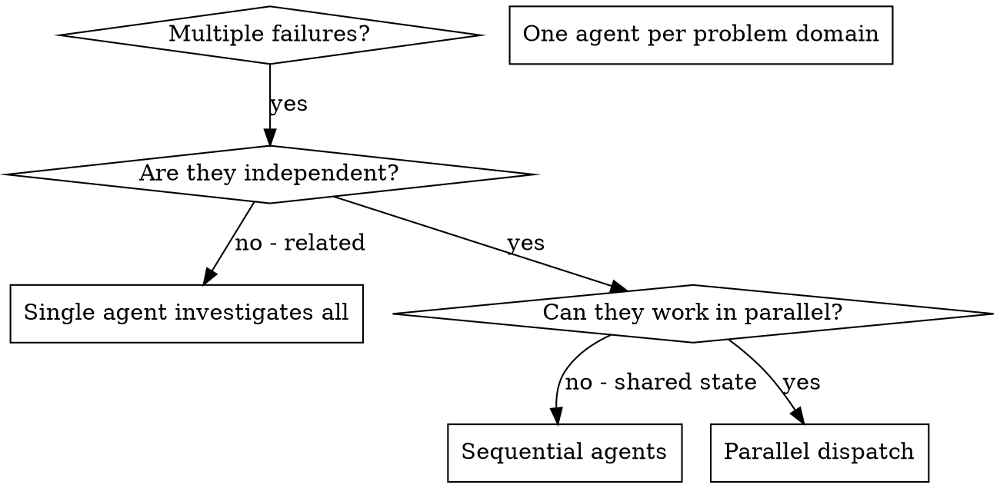

# 并行派遣代理

## 概述

你将任务委派给具有隔离上下文的专业化代理。通过精确构建它们的指令和上下文，确保它们专注于任务并成功完成。它们绝不应继承你会话的上下文或历史记录 — 你构建它们所需的确切内容。这也有助于保留你自己的上下文用于协调工作。

当你有多个不相关的失败（不同的测试文件、不同的子系统、不同的 Bug）时，逐一排查会浪费时间。每次调查都是独立的，可以并行进行。

**核心原则：** 每个独立问题域派遣一个代理。让它们并发工作。

## 何时使用



**适用场景：**
- 3 个以上测试文件因不同根因失败
- 多个子系统独立损坏
- 每个问题无需其他上下文即可理解
- 调查之间无共享状态

**不适用场景：**
- 失败之间存在关联（修复一个可能修复其他）
- 需要理解完整的系统状态
- 代理之间会相互干扰

## 模式

### 1. 识别独立领域

按损坏内容对失败进行分组：
- 文件 A 测试：工具审批流程
- 文件 B 测试：批量完成行为
- 文件 C 测试：中止功能

每个领域都是独立的 — 修复工具审批不会影响中止测试。

### 2. 创建聚焦的代理任务

每个代理获得：
- **具体范围：** 一个测试文件或子系统
- **清晰目标：** 使这些测试通过
- **约束条件：** 不更改其他代码
- **预期输出：** 你所发现和修复的内容摘要

### 3. 并行派遣

```typescript
// In Claude Code / AI environment
Task("Fix agent-tool-abort.test.ts failures")
Task("Fix batch-completion-behavior.test.ts failures")
Task("Fix tool-approval-race-conditions.test.ts failures")
// All three run concurrently
```

### 4. 审查与整合

当代理返回时：
- 阅读每份摘要
- 验证修复不会冲突
- 运行完整测试套件
- 整合所有更改

## 代理提示结构

优秀的代理提示应具备：
1. **聚焦** - 一个清晰的问题域
2. **自包含** - 理解问题所需的所有上下文
3. **明确输出** - 代理应返回什么内容？

```markdown
Fix the 3 failing tests in src/agents/agent-tool-abort.test.ts:

1. "should abort tool with partial output capture" - expects 'interrupted at' in message
2. "should handle mixed completed and aborted tools" - fast tool aborted instead of completed
3. "should properly track pendingToolCount" - expects 3 results but gets 0

These are timing/race condition issues. Your task:

1. Read the test file and understand what each test verifies
2. Identify root cause - timing issues or actual bugs?
3. Fix by:
   - Replacing arbitrary timeouts with event-based waiting
   - Fixing bugs in abort implementation if found
   - Adjusting test expectations if testing changed behavior

Do NOT just increase timeouts - find the real issue.

Return: Summary of what you found and what you fixed.
```

## 常见错误

**❌ 过于宽泛：** "修复所有测试" — 代理会迷失方向
**✅ 具体明确：** "修复 agent-tool-abort.test.ts" — 聚焦范围

**❌ 缺少上下文：** "修复竞态条件" — 代理不知道位置
**✅ 提供上下文：** 粘贴错误消息和测试名称

**❌ 没有约束：** 代理可能会重构一切
**✅ 设定约束：** "不要更改生产代码" 或 "仅修复测试"

**❌ 输出模糊：** "修复它" — 你不知道更改了什么
**✅ 具体明确：** "返回根因和更改的摘要"

## 何时不使用

**关联失败：** 修复一个可能修复其他 — 先一起调查
**需要完整上下文：** 理解需要查看整个系统
**探索性调试：** 你还不知道哪里出了问题
**共享状态：** 代理会相互干扰（编辑同一文件、使用同一资源）

## 会话中的真实示例

**场景：** 大型重构后，3 个文件出现 6 个测试失败

**失败：**
- agent-tool-abort.test.ts：3 个失败（时序问题）
- batch-completion-behavior.test.ts：2 个失败（工具未执行）
- tool-approval-race-conditions.test.ts：1 个失败（执行计数 = 0）

**决策：** 独立领域 — 中止逻辑、批量完成和竞态条件互不相关

**派遣：**
```
Agent 1 → Fix agent-tool-abort.test.ts
Agent 2 → Fix batch-completion-behavior.test.ts
Agent 3 → Fix tool-approval-race-conditions.test.ts
```

**结果：**
- 代理 1：用基于事件的等待替换了超时
- 代理 2：修复了事件结构 Bug（threadId 位置错误）
- 代理 3：添加了对异步工具执行完成的等待

**整合：** 所有修复独立，无冲突，完整测试套件通过

**节省的时间：** 3 个问题并行解决，而非串行

## 关键优势

1. **并行化** - 多项调查同时进行
2. **聚焦** - 每个代理范围狭窄，需跟踪的上下文更少
3. **独立性** - 代理互不干扰
4. **速度** - 3 个问题在 1 个问题的时间内解决

## 验证

代理返回后：
1. **审查每份摘要** - 了解变更内容
2. **检查冲突** - 代理是否编辑了相同代码？
3. **运行完整套件** - 验证所有修复协同工作
4. **抽查** - 代理可能犯系统性错误

## 实际效果

来自调试会话（2025-10-03）：
- 3 个文件共 6 个失败
- 并行派遣了 3 个代理
- 所有调查同时完成
- 所有修复成功整合
- 代理更改之间零冲突
