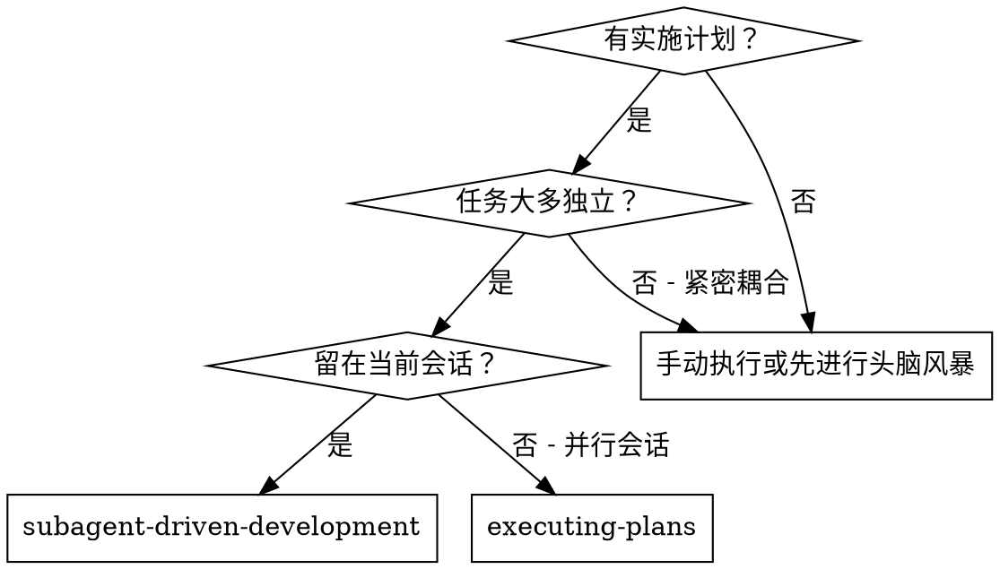
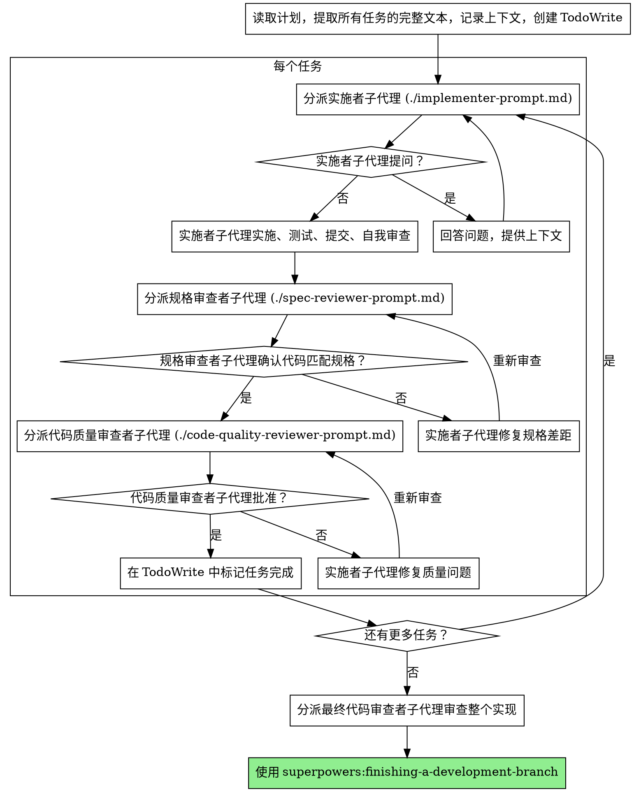

# 子代理驱动开发

通过为每个任务分派全新的子代理来执行计划，每个任务完成后进行两阶段审查：先进行规格合规性审查，再进行代码质量审查。

**为什么使用子代理：** 你将任务委派给具有独立上下文的专业化代理。通过精确构建它们的指令和上下文，你确保它们保持专注并成功完成任务。它们永远不应该继承你会话的上下文或历史记录——你精确构建它们所需的内容。这也为你自己的协调工作保留了上下文。

**核心原则：** 每个任务使用全新子代理 + 两阶段审查（规格审查后质量审查）= 高质量、快速迭代

**持续执行：** 不要在任务之间暂停与你的伙伴确认。不间断地执行计划中的所有任务。唯一需要停止的原因是：你无法解决的 BLOCKED 状态、真正阻碍进展的歧义，或所有任务已完成。"我应该继续吗？"的提示和进度摘要会浪费他们的时间——他们让你执行计划，那就执行它。

## 何时使用



**vs. 执行计划（并行会话）：**
- 同一会话（无需上下文切换）
- 每个任务使用全新子代理（无上下文污染）
- 每个任务后进行两阶段审查：先规格合规性，再代码质量
- 更快的迭代（任务之间无需人工介入）

## 流程



## 模型选择

使用能够胜任每个角色的最弱模型，以节省成本并提高速度。

**机械性实施任务**（独立函数、清晰规格、1-2 个文件）：使用快速、廉价的模型。当计划定义良好时，大多数实施任务都是机械性的。

**集成和判断任务**（多文件协调、模式匹配、调试）：使用标准模型。

**架构、设计和审查任务**：使用能力最强的可用模型。

**任务复杂度信号：**
- 涉及 1-2 个文件且有完整规格 → 廉价模型
- 涉及多个文件且有集成问题 → 标准模型
- 需要设计判断或广泛的代码库理解 → 能力最强的模型

## 处理实施者状态

实施者子代理报告四种状态之一。相应地处理每种状态：

**DONE（完成）：** 继续进行规格合规性审查。

**DONE_WITH_CONCERNS（完成但有顾虑）：** 实施者完成了工作但标记了疑虑。在继续之前阅读这些顾虑。如果顾虑是关于正确性或范围，在审查之前解决它们。如果只是观察意见（例如，"这个文件变得很大"），记录下来并继续审查。

**NEEDS_CONTEXT（需要上下文）：** 实施者需要未提供的信息。提供缺失的上下文并重新分派。

**BLOCKED（阻塞）：** 实施者无法完成任务。评估阻塞原因：
1. 如果是上下文问题，提供更多上下文并使用相同模型重新分派
2. 如果任务需要更多推理，使用能力更强的模型重新分派
3. 如果任务太大，将其拆分为更小的部分
4. 如果计划本身有问题，升级给人类处理

**永远不要**忽略升级或在没有改变的情况下强制同一模型重试。如果实施者说它卡住了，那么就需要做出改变。

## 提示模板

- `./implementer-prompt.md` - 分派实施者子代理
- `./spec-reviewer-prompt.md` - 分派规格合规性审查者子代理
- `./code-quality-reviewer-prompt.md` - 分派代码质量审查者子代理

## 示例工作流

```
你：我正在使用子代理驱动开发来执行这个计划。

[读取一次计划文件：docs/superpowers/plans/feature-plan.md]
[提取所有 5 个任务的完整文本和上下文]
[使用 TodoWrite 创建所有任务]

任务 1：钩子安装脚本

[获取任务 1 的文本和上下文（已提取）]
[使用完整任务文本 + 上下文分派实施子代理]

实施者："在开始之前——钩子应该安装在用户级别还是系统级别？"

你："用户级别 (~/.config/superpowers/hooks/)"

实施者："收到。正在实施..."
[稍后] 实施者：
  - 实现了 install-hook 命令
  - 添加了测试，5/5 通过
  - 自我审查：发现遗漏了 --force 标志，已添加
  - 已提交

[分派规格合规性审查者]
规格审查者：✅ 符合规格 - 满足所有需求，无额外内容

[获取 git SHA，分派代码质量审查者]
代码审查者：优点：测试覆盖良好，代码整洁。问题：无。已批准。

[标记任务 1 完成]

任务 2：恢复模式

[获取任务 2 的文本和上下文（已提取）]
[使用完整任务文本 + 上下文分派实施子代理]

实施者：[没有问题，直接进行]
实施者：
  - 添加了验证/修复模式
  - 8/8 测试通过
  - 自我审查：一切良好
  - 已提交

[分派规格合规性审查者]
规格审查者：❌ 问题：
  - 缺少：进度报告（规格要求"每 100 项报告一次"）
  - 多余：添加了 --json 标志（未要求）

[实施者修复问题]
实施者：移除了 --json 标志，添加了进度报告

[规格审查者再次审查]
规格审查者：✅ 现在符合规格

[分派代码质量审查者]
代码审查者：优点：扎实。问题（重要）：魔法数字（100）

[实施者修复]
实施者：提取了 PROGRESS_INTERVAL 常量

[代码审查者再次审查]
代码审查者：✅ 已批准

[标记任务 2 完成]

...

[所有任务完成后]
[分派最终代码审查者]
最终审查者：所有需求已满足，可以合并

完成！
```

## 优势

**vs. 手动执行：**
- 子代理自然遵循 TDD
- 每个任务有全新上下文（无混淆）
- 并行安全（子代理不互相干扰）
- 子代理可以提问（在开始之前和工作期间）

**vs. 执行计划：**
- 同一会话（无需交接）
- 持续进展（无需等待）
- 审查检查点自动进行

**效率提升：**
- 无文件读取开销（控制者提供完整文本）
- 控制者精确策划所需上下文
- 子代理提前获得完整信息
- 问题在工作开始前暴露（而不是之后）

**质量关卡：**
- 自我审查在交接前发现问���
- 两阶段审查：先规格合规性，再代码质量
- 审查循环确保修复实际有效
- 规格合规性防止过度/不足构建
- 代码质量确保实现构建良好

**成本：**
- 更多子代理调用（每个任务 1 个实施者 + 2 个审查者）
- 控制者做更多准备工作（提前提取所有任务）
- 审查循环增加迭代次数
- 但早期发现问题（比后期调试更便宜）

## 红旗警告

**绝对不要：**
- 在没有用户明确同意的情况下在 main/master 分支上开始实施
- 跳过审查（规格合规性或代码质量）
- 带着未修复的问题继续推进
- 并行分派多个实施子代理（冲突）
- 让子代理读取计划文件（改为提供完整文本）
- 跳过场景设置上下文（子代理需要理解任务在何处适配）
- 忽略子代理的问题（在让他们继续之前回答）
- 在规格合规性上接受"差不多就行"（规格审查者发现问题 = 未完成）
- 跳过审查循环（审查者发现问题 = 实施者修复 = 再次审查）
- 让实施者的自我审查替代实际审查（两者都需要）
- **在规格合规性通过 ✅ 之前开始代码质量审查**（顺序错误）
- 在任一审查有未解决问题时移到下一个任务

**如果子代理提问：**
- 清晰完整地回答
- 必要时提供额外上下文
- 不要催促他们进行实施

**如果审查者发现问题：**
- 实施者（同一子代理）修复问题
- 审查者再次审查
- 重复直到批准
- 不要跳过重新审查

**如果子代理任务失败：**
- 分派带有具体说明的修复子代理
- 不要尝试手动修复（上下文污染）

## 集成

**所需工作流技能：**
- **superpowers:using-git-worktrees** - 确保隔离的工作空间（创建一个或验证已有的）
- **superpowers:writing-plans** - 创建此技能要执行的计划
- **superpowers:requesting-code-review** - 审查者子代理的代码审查模板
- **superpowers:finishing-a-development-branch** - 在所有任务完成后完成开发

**子代理应使用：**
- **superpowers:test-driven-development** - 子代理对每个任务遵循 TDD

**替代工作流：**
- **superpowers:executing-plans** - 用于并行会话而非同一会话执行
