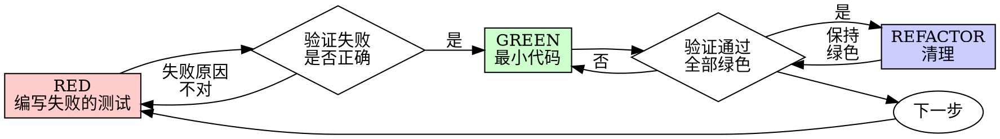

# 测试驱动开发 (TDD)

## 概述

先写测试。观察它失败。编写最小代码通过。

**核心原则：** 如果你没有看到测试失败过，你就不知道它是否测试了正确的东西。

**违反规则的文字就是违反规则的精神。**

## 何时使用

**始终使用：**
- 新功能
- Bug 修复
- 重构
- 行为变更

**例外情况（需征得你的 human partner 同意）：**
- 一次性原型
- 生成的代码
- 配置文件

在想"就这一次跳过 TDD"？停下。那是在找借口。

## 铁律

```
没有先编写失败的测试，就不写生产代码
```

先写了代码？删掉。重新开始。

**没有例外：**
- 不要把它留作"参考"
- 不要在写测试时"改造"它
- 不要看它
- 删除就是删除

从测试开始全新实现。句号。

## 红-绿-重构



### RED - 编写失败的测试

编写一个最小测试，展示应该发生什么。

<Good>
```typescript
test('retries failed operations 3 times', async () => {
  let attempts = 0;
  const operation = () => {
    attempts++;
    if (attempts < 3) throw new Error('fail');
    return 'success';
  };

  const result = await retryOperation(operation);

  expect(result).toBe('success');
  expect(attempts).toBe(3);
});
```
名称清晰，测试真实行为，只测一件事
</Good>

<Bad>
```typescript
test('retry works', async () => {
  const mock = jest.fn()
    .mockRejectedValueOnce(new Error())
    .mockRejectedValueOnce(new Error())
    .mockResolvedValueOnce('success');
  await retryOperation(mock);
  expect(mock).toHaveBeenCalledTimes(3);
});
```
名称模糊，测试 mock 而非代码
</Bad>

**要求：**
- 一个行为
- 清晰的名称
- 真实代码（除非不可避免，否则不用 mock）

### 验证 RED - 观察它失败

**必须执行。绝不能跳过。**

```bash
npm test path/to/test.test.ts
```

确认：
- 测试失败（而不是报错）
- 失败信息符合预期
- 失败是因为功能缺失（而不是拼写错误）

**测试通过了？** 你在测试已有行为。修复测试。

**测试报错了？** 修复错误，重新运行，直到正确失败。

### GREEN - 最小代码

编写最简代码来通过测试。

<Good>
```typescript
async function retryOperation<T>(fn: () => Promise<T>): Promise<T> {
  for (let i = 0; i < 3; i++) {
    try {
      return await fn();
    } catch (e) {
      if (i === 2) throw e;
    }
  }
  throw new Error('unreachable');
}
```
刚好够通过
</Good>

<Bad>
```typescript
async function retryOperation<T>(
  fn: () => Promise<T>,
  options?: {
    maxRetries?: number;
    backoff?: 'linear' | 'exponential';
    onRetry?: (attempt: number) => void;
  }
): Promise<T> {
  // YAGNI
}
```
过度设计
</Bad>

不要添加测试范围之外的功能、重构其他代码或进行"改进"。

### 验证 GREEN - 观察它通过

**必须执行。**

```bash
npm test path/to/test.test.ts
```

确认：
- 测试通过
- 其他测试仍然通过
- 输出干净（没有错误、警告）

**测试失败了？** 修复代码，而不是测试。

**其他测试失败了？** 立即修复。

### REFACTOR - 清理

仅在通过后执行：
- 消除重复
- 改进命名
- 提取辅助方法

保持测试通过。不要添加行为。

### 重复

为下一个功能编写下一个会失败的测试。

## 好的测试

| 质量 | 好 | 差 |
|---------|------|-----|
| **最小** | 只测一件事。名称里带了"和"？拆开。 | `test('validates email and domain and whitespace')` |
| **清晰** | 名称描述行为 | `test('test1')` |
| **展示意图** | 演示期望的 API | 掩盖代码应该做什么 |

## 为什么顺序很重要

**"我之后再写测试来验证它能工作"**

代码之后写的测试会立即通过。立即通过什么都证明不了：
- 可能测错了东西
- 可能测试了实现，而不是行为
- 可能遗漏了你忘记的边缘情况
- 你从未看到它捕获过 Bug

测试优先迫使你看到测试失败，证明它确实在测试某个东西。

**"我已经手动测试了所有边缘情况"**

手动测试是临时性的。你以为测试了全部，但实际上：
- 没有测试记录
- 代码变更后无法重新运行
- 压力下容易遗漏情况
- "我试过能行" ≠ 全面覆盖

自动化测试是系统性的。它们每次都按相同方式运行。

**"删掉 X 小时的工作太浪费了"**

沉没成本谬误。时间已经花掉了。你现在面临的选择是：
- 删掉并用 TDD 重写（再花 X 小时，高置信度）
- 保留下来之后补测试（30 分钟，低置信度，很可能有 Bug）

真正的"浪费"是保留你不信任的代码。没有真正测试的可用代码就是技术债务。

**"TDD 是教条主义，务实意味着灵活变通"**

TDD 本身就务实：
- 在提交前发现 Bug（比事后调试更快）
- 防止回归（测试立即捕获破坏）
- 文档化行为（测试展示如何使用代码）
- 支持重构（自由修改，测试捕获破坏）

"务实"的捷径 = 在生产中调试 = 更慢。

**"后写测试也能达到同样的目标——这是精神而不是仪式"**

不对。后写测试回答的是"这段代码做了什么？"先写测试回答的是"这段代码应该做什么？"

后写测试会受到你实现方式的偏见影响。你测试的是你构建的东西，而不是需要的东西。你验证的是你记得的边缘情况，而不是新发现的边缘情况。

先写测试迫使你在实现之前发现边缘情况。后写测试验证你记得所有情况（但你并没有）。

花 30 分钟后补测试 ≠ TDD。你获得了覆盖率，却失去了测试有效的证明。

## 常见的借口

| 借口 | 真相 |
|--------|---------|
| "太简单了不用测" | 简单的代码也会出问题。测试只要 30 秒。 |
| "我之后再测" | 立即通过的测试什么都证明不了。 |
| "后写测试也能达到同样目标" | 后写测试 = "这段代码做了什么？" 先写测试 = "这段代码应该做什么？" |
| "已经手动测试过了" | 临时 ≠ 系统。没有记录，无法重新运行。 |
| "删掉 X 小时太浪费" | 沉没成本谬误。保留未验证的代码就是技术债务。 |
| "先留着当参考，再写测试" | 你会去改造它的。那还是后写测试。删除就是删除。 |
| "需要先探索一下" | 可以。扔掉探索代码，用 TDD 重新开始。 |
| "测试难写 = 设计不清晰" | 听从测试的反馈。难测 = 难用。 |
| "TDD 会拖慢我" | TDD 比调试更快。务实 = 测试优先。 |
| "手动测试更快" | 手动测试不证明边缘情况。每次改动你都要重新测。 |
| "现有代码没有测试" | 你正在改进它。为现有代码添加测试。 |

## 红旗警示 - 停下并重新开始

- 先写代码后写测试
- 实现之后再补测试
- 测试立即通过
- 说不清测试为什么失败
- "之后再"添加测试
- 找借口说"就这一次"
- "我已经手动测试过了"
- "后写测试也能达到同样的目的"
- "这是精神而不是仪式"
- "留着当参考"或"改造现有代码"
- "已经花了 X 小时，删掉太浪费"
- "TDD 是教条主义，我要务实"
- "这次情况不同，因为……"

**所有这些都意味着：删除代码。用 TDD 重新开始。**

## 示例：Bug 修复

**Bug:** 空邮箱被接受

**RED**
```typescript
test('rejects empty email', async () => {
  const result = await submitForm({ email: '' });
  expect(result.error).toBe('Email required');
});
```

**验证 RED**
```bash
$ npm test
FAIL: expected 'Email required', got undefined
```

**GREEN**
```typescript
function submitForm(data: FormData) {
  if (!data.email?.trim()) {
    return { error: 'Email required' };
  }
  // ...
}
```

**验证 GREEN**
```bash
$ npm test
PASS
```

**REFACTOR**
如果需要，为多个字段提取验证逻辑。

## 验证清单

在标记工作完成之前：

- [ ] 每个新函数/方法都有测试
- [ ] 在实现之前观察了每个测试失败
- [ ] 每个测试因预期原因失败（功能缺失，而非拼写错误）
- [ ] 编写了最小代码来通过每个测试
- [ ] 所有测试通过
- [ ] 输出干净（没有错误、警告）
- [ ] 测试使用真实代码（仅当不可避免时才用 mock）
- [ ] 覆盖了边缘情况和错误

无法勾选所有项？你跳过了 TDD。重新开始。

## 遇到困难时

| 问题 | 解决方案 |
|---------|----------|
| 不知道怎么测 | 先写你期望的 API。先写断言。向你的 human partner 请教。 |
| 测试太复杂 | 设计太复杂。简化接口。 |
| 必须 mock 一切 | 代码耦合太严重。使用依赖注入。 |
| 测试准备工作量太大 | 提取辅助方法。仍然复杂？简化设计。 |

## 调试集成

发现了 Bug？编写能复现它的失败测试。遵循 TDD 周期。测试证明了修复并防止回归。

绝不能在没有测试的情况下修复 Bug。

## 测试反模式

在添加 mock 或测试工具时，请阅读 @testing-anti-patterns.md 以避免常见陷阱：
- 测试 mock 行为而非真实行为
- 向生产类中添加仅测试使用的方法
- 在不理解依赖关系的情况下进行 mock

## 最终规则

```
生产代码 → 存在测试且测试先失败过
否则 → 不是 TDD
```

未经你的 human partner 允许，没有例外。
