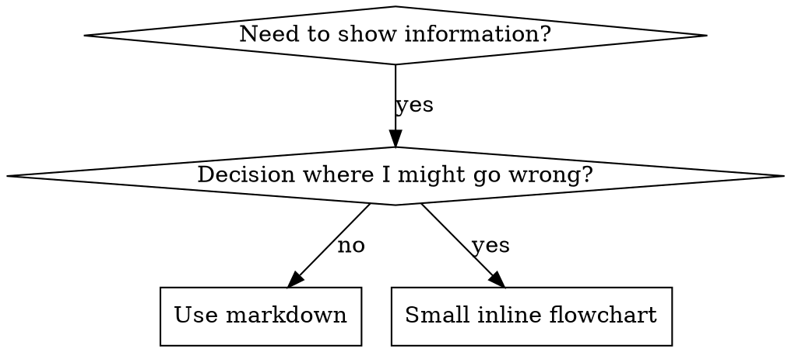

# 编写技能

## 概述

**编写技能就是将测试驱动开发应用于流程文档。**

**个人技能存放在特定于代理的目录中（Claude Code 使用 `~/.claude/skills`，Codex 使用 `~/.agents/skills/`）**

你编写测试用例（包含子代理的压力场景），观察它们失败（基线行为），编写技能（文档），观察测试通过（代理遵守），然后重构（堵住漏洞）。

**核心原则：** 如果你没有观察过代理在没有该技能的情况下失败，你就不知道这个技能是否教会了正确的东西。

**必备前置知识：** 在使用此技能之前，你**必须**理解 superpowers:test-driven-development。该技能定义了基本的 RED-GREEN-REFACTOR 循环。本技能将 TDD 适配到文档编写。

**官方指南：** 有关 Anthropic 官方技能编写最佳实践，请参阅 anthropic-best-practices.md。本文档提供了额外的模式和指南，作为本技能中 TDD 导向方法的补充。

## 什么是技能？

**技能**是经过验证的技术、模式或工具的参考指南。技能帮助未来的 Claude 实例找到并应用有效的方法。

**技能是：** 可复用的技术、模式、工具、参考指南

**技能不是：** 关于你曾经如何解决某个问题的叙述故事

## 技能的 TDD 映射

| TDD 概念 | 技能创建 |
|-------------|----------------|
| **测试用例** | 包含子代理的压力场景 |
| **生产代码** | 技能文档（SKILL.md） |
| **测试失败（RED）** | 代理在没有技能时违反规则（基线） |
| **测试通过（GREEN）** | 代理在有技能时遵守规则 |
| **重构** | 在保持合规性的同时堵住漏洞 |
| **先写测试** | 在编写技能**之前**运行基线场景 |
| **观察失败** | 记录代理使用的确切合理化说辞 |
| **最小代码** | 编写针对那些特定违规行为的技能 |
| **观察通过** | 验证代理现在遵守规则 |
| **重构循环** | 发现新的合理化说辞 → 堵住 → 重新验证 |

整个技能创建过程遵循 RED-GREEN-REFACTOR。

## 何时创建技能

**在以下情况创建：**
- 某种技术对你来说不是直觉上显而易见的
- 你会在多个项目中再次参考它
- 模式广泛适用（而非特定于项目）
- 其他人会从中受益

**不要为以下情况创建：**
- 一次性解决方案
- 其他地方已有完善文档的标准实践
- 项目特定的约定（放在 CLAUDE.md 中）
- 机械性约束（如果可以用正则/验证来强制执行，就将其自动化——把文档留给需要判断的地方）

## 技能类型

### 技术
具有可遵循步骤的具体方法（condition-based-waiting, root-cause-tracing）

### 模式
思考问题的方式（flatten-with-flags, test-invariants）

### 参考
API 文档、语法指南、工具文档（office docs）

## 目录结构


```
skills/
  skill-name/
    SKILL.md              # 主要参考（必需）
    supporting-file.*     # 仅在需要时
```

**扁平命名空间** - 所有技能都在一个可搜索的命名空间中

**以下情况使用独立文件：**
1. **重型参考**（100 行以上）- API 文档、综合语法
2. **可复用工具** - 脚本、工具、模板

**以下情况保持内联：**
- 原则和概念
- 代码模式（少于 50 行）
- 其他所有内容

## SKILL.md 结构

**前置元数据（YAML）：**
- 两个必需字段：`name` 和 `description`（参见 [agentskills.io/specification](https://agentskills.io/specification) 了解所有支持的字段）
- 总共最多 1024 个字符
- `name`：仅使用字母、数字和连字符（无括号、特殊字符）
- `description`：第三人称，仅描述**何时使用**（而不是做什么）
  - 以"Use when..."开头以聚焦触发条件
  - 包含具体的症状、情境和上下文
  - **绝不总结技能的过程或工作流**（原因参见 CSO 章节）
  - 尽可能保持在 500 字符以内

```markdown
---
name: Skill-Name-With-Hyphens
description: Use when [specific triggering conditions and symptoms]
---

# Skill Name

## Overview
这是什么？用 1-2 句话概括核心原则。

## When to Use
[如果决策不明显，使用小型内联流程图]

包含症状和用例的列表
何时不使用

## Core Pattern（针对技术/模式）
Before/after 代码对比

## Quick Reference
用于快速浏览常见操作的表格或列表

## Implementation
简单模式使用内联代码
重型参考或可复用工具则链接到文件

## Common Mistakes
出问题的地方 + 修复方法

## Real-World Impact（可选）
具体成果
```


## Claude 搜索优化（CSO）

**对发现至关重要：** 未来的 Claude 需要**找到**你的技能

### 1. 丰富的描述字段

**目的：** Claude 读取描述来决定为给定任务加载哪些技能。让它回答："我现在应该阅读这个技能吗？"

**格式：** 以"Use when..."开头以聚焦触发条件

**关键：描述 = 何时使用，而非技能做什么**

描述应**仅**描述触发条件。**不要**在描述中总结技能的过程或工作流。

**为什么这很重要：** 测试发现，当描述总结了技能的工作流时，Claude 可能会遵循描述而不是阅读完整的技能内容。描述为"code review between tasks"导致 Claude 只做了一次审查，尽管技能的流程图清楚显示了两轮审查（规范合规性审查和代码质量审查）。

当描述改为仅仅"Use when executing implementation plans with independent tasks"（不包含工作流总结）时，Claude 正确读取了流程图并遵循了两阶段审查流程。

**陷阱：** 总结工作流的描述创建了一条 Claude 会走的捷径。技能正文变成了 Claude 跳过的文档。

```yaml
# ❌ 不好：总结了工作流 - Claude 可能遵循此描述而非阅读技能
description: Use when executing plans - dispatches subagent per task with code review between tasks

# ❌ 不好：过程细节过多
description: Use for TDD - write test first, watch it fail, write minimal code, refactor

# ✅ 好：仅触发条件，无工作流总结
description: Use when executing implementation plans with independent tasks in the current session

# ✅ 好：仅触发条件
description: Use when implementing any feature or bugfix, before writing implementation code
```

**内容：**
- 使用具体的触发条件、症状和表明该技能适用的情境
- 描述**问题**（竞态条件、不一致行为），而非**特定于语言的症状**（setTimeout, sleep）
- 保持触发条件与技术无关，除非技能本身是特定于技术的
- 如果技能是特定于技术的，在触发条件中明确说明
- 使用第三人称编写（注入到系统提示中）
- **绝不总结技能的过程或工作流**

```yaml
# ❌ 不好：过于抽象、模糊，未包含何时使用
description: For async testing

# ❌ 不好：第一人称
description: I can help you with async tests when they're flaky

# ❌ 不好：提到了技术但技能并非特定于该技术
description: Use when tests use setTimeout/sleep and are flaky

# ✅ 好：以"Use when"开头，描述问题，无工作流
description: Use when tests have race conditions, timing dependencies, or pass/fail inconsistently

# ✅ 好：特定于技术的技能，带有明确的触发条件
description: Use when using React Router and handling authentication redirects
```

### 2. 关键词覆盖

使用 Claude 会搜索的词语：
- 错误消息："Hook timed out", "ENOTEMPTY", "race condition"
- 症状："flaky", "hanging", "zombie", "pollution"
- 同义词："timeout/hang/freeze", "cleanup/teardown/afterEach"
- 工具：实际命令、库名、文件类型

### 3. 描述性命名

**使用主动语态，动词优先：**
- ✅ `creating-skills` 而非 `skill-creation`
- ✅ `condition-based-waiting` 而非 `async-test-helpers`

### 4. Token 效率（关键）

**问题：** getting-started 和经常被引用的技能会加载到**每一次**对话中。每个 token 都很重要。

**目标字数：**
- getting-started 工作流：每个少于 150 字
- 频繁加载的技能：总共少于 200 字
- 其他技能：少于 500 字（仍需简洁）

**技巧：**

**将细节移至工具帮助：**
```bash
# ❌ 不好：在 SKILL.md 中记录所有标志
search-conversations supports --text, --both, --after DATE, --before DATE, --limit N

# ✅ 好：引用 --help
search-conversations supports multiple modes and filters. Run --help for details.
```

**使用交叉引用：**
```markdown
# ❌ 不好：重复工作流细节
When searching, dispatch subagent with template...
[20 lines of repeated instructions]

# ✅ 好：引用其他技能
Always use subagents (50-100x context savings). REQUIRED: Use [other-skill-name] for workflow.
```

**压缩示例：**
```markdown
# ❌ 不好：冗长示例（42 个词）
your human partner: "How did we handle authentication errors in React Router before?"
You: I'll search past conversations for React Router authentication patterns.
[Dispatch subagent with search query: "React Router authentication error handling 401"]

# ✅ 好：最小示例（20 个词）
Partner: "How did we handle auth errors in React Router?"
You: Searching...
[Dispatch subagent → synthesis]
```

**消除冗余：**
- 不要重复交叉引用技能中已有的内容
- 不要解释命令中显而易见的内容
- 不要包含同一模式的多个示例

**验证：**
```bash
wc -w skills/path/SKILL.md
# getting-started workflows: aim for <150 each
# Other frequently-loaded: aim for <200 total
```

**根据你做什么或核心见解来命名：**
- ✅ `condition-based-waiting` > `async-test-helpers`
- ✅ `using-skills` 而非 `skill-usage`
- ✅ `flatten-with-flags` > `data-structure-refactoring`
- ✅ `root-cause-tracing` > `debugging-techniques`

**动名词（-ing 形式）适用于流程：**
- `creating-skills`, `testing-skills`, `debugging-with-logs`
- 主动，描述你正在采取的行动

### 4. 交叉引用其他技能

**在编写引用其他技能的文档时：**

仅使用技能名称，并附上明确的要求标记：
- ✅ 好：`**REQUIRED SUB-SKILL:** Use superpowers:test-driven-development`
- ✅ 好：`**REQUIRED BACKGROUND:** You MUST understand superpowers:systematic-debugging`
- ❌ 不好：`See skills/testing/test-driven-development`（不清楚是否为必需）
- ❌ 不好：`@skills/testing/test-driven-development/SKILL.md`（强制加载，消耗上下文）

**为什么不用 @ 链接：** `@` 语法会立即强制加载文件，在你需要它们之前就消耗 200k+ 上下文。

## 流程图使用



**仅在以下情况使用流程图：**
- 非显而易见的决策点
- 你可能过早停止的过程循环
- "何时使用 A 与 B"的决策

**绝不在以下情况使用流程图：**
- 参考材料 → 表格、列表
- 代码示例 → Markdown 代码块
- 线性指令 → 编号列表
- 没有语义含义的标签（step1, helper2）

参见 @graphviz-conventions.dot 了解 graphviz 样式规则。

**为你的人类伙伴可视化：** 使用此目录中的 `render-graphs.js` 将技能的流程图渲染为 SVG：
```bash
./render-graphs.js ../some-skill           # 每个图表单独渲染
./render-graphs.js ../some-skill --combine # 所有图表合并到一个 SVG
```

## 代码示例

**一个优秀的示例胜过许多平庸的示例**

选择最相关的语言：
- 测试技术 → TypeScript/JavaScript
- 系统调试 → Shell/Python
- 数据处理 → Python

**好的示例：**
- 完整且可运行
- 注释完善，解释**为什么**
- 来自真实场景
- 清晰展示模式
- 可立即适配（非通用模板）

**不要：**
- 用 5 种以上语言实现
- 创建填空模板
- 编写牵强的示例

你擅长移植——一个优秀的示例就足够了。

## 文件组织

### 自包含技能
```
defense-in-depth/
  SKILL.md    # 所有内容内联
```
适用场景：所有内容都能容纳，无需重型参考

### 带有可复用工具的技能
```
condition-based-waiting/
  SKILL.md    # 概述 + 模式
  example.ts  # 可供适配的工作助手
```
适用场景：工具是可复用的代码，而不仅仅是叙述

### 带有重型参考的技能
```
pptx/
  SKILL.md       # 概述 + 工作流
  pptxgenjs.md   # 600 行 API 参考
  ooxml.md       # 500 行 XML 结构
  scripts/       # 可执行工具
```
适用场景：参考材料太大，不适合内联

## 铁律（与 TDD 相同）

```
没有失败测试在先，就没有技能
```

这适用于**新**技能和**对现有技能的编辑**。

在测试之前就编写了技能？删除它。重新开始。
未经测试就编辑技能？同样的违规。

**无例外：**
- 不适用于"简单添加"
- 不适用于"只是增加一个章节"
- 不适用于"文档更新"
- 不要将未经测试的更改保留为"参考"
- 不要在运行测试时"适配"
- 删除就是删除

**必备前置知识：** superpowers:test-driven-development 技能解释了为什么这很重要。相同的原则适用于文档。

## 测试所有技能类型

不同类型的技能需要不同的测试方法：

### 纪律强制型技能（规则/要求）

**示例：** TDD, verification-before-completion, designing-before-coding

**测试方法：**
- 学术问题：他们是否理解规则？
- 压力场景：他们在压力下是否遵守规则？
- 多重压力组合：时间 + 沉没成本 + 疲劳
- 识别合理化说辞并添加明确的对抗项

**成功标准：** 代理在最大压力下遵循规则

### 技术型技能（操作指南）

**示例：** condition-based-waiting, root-cause-tracing, defensive-programming

**测试方法：**
- 应用场景：他们能否正确应用该技术？
- 变体场景：他们能否处理边界情况？
- 信息缺失测试：指令是否有缺口？

**成功标准：** 代理成功将技术应用于新场景

### 模式型技能（思维模型）

**示例：** reducing-complexity, information-hiding concepts

**测试方法：**
- 识别场景：他们能否识别何时适用该模式？
- 应用场景：他们能否使用思维模型？
- 反例：他们是否知道何时**不**适用？

**成功标准：** 代理正确识别何时/如何应用模式

### 参考型技能（文档/API）

**示例：** API 文档、命令参考、库指南

**测试方法：**
- 检索场景：他们能否找到正确的信息？
- 应用场景：他们能否正确使用找到的信息？
- 缺口测试：常见用例是否覆盖到位？

**成功标准：** 代理找到并正确应用参考信息

## 跳过测试的常见合理化说辞

| 借口 | 现实 |
|--------|---------|
| "技能显然很清晰" | 对你清晰 ≠ 对其他代理清晰。测试它。 |
| "这只是个参考" | 参考可能有缺口、不清晰的章节。测试检索。 |
| "测试是过度杀伤" | 未经测试的技能总是有问题。15 分钟测试能节省数小时。 |
| "如果有问题我会再测" | 问题 = 代理无法使用技能。在部署**之前**测试。 |
| "测试太繁琐了" | 测试比在生产中调试糟糕的技能要轻松得多。 |
| "我有信心它很好" | 过度自信保证会有问题。无论如何都要测试。 |
| "学术评审就够了" | 阅读 ≠ 使用。测试应用场景。 |
| "没时间测试" | 部署未经测试的技能以后修复它会浪费更多时间。 |

**所有这些都意味着：在部署前测试。无例外。**

## 使技能防合理化攻击

强制纪律的技能（如 TDD）需要抵抗合理化。代理很聪明，会在压力下找到漏洞。

**心理学说明：** 理解为什么说服技巧有效，可以帮助你系统地应用它们。参见 persuasion-principles.md 了解关于权威、承诺、稀缺性、社会认同和团结原则的研究基础（Cialdini, 2021; Meincke et al., 2025）。

### 明确堵住每一个漏洞

不要只陈述规则——要禁止特定的变通方法：

<Bad>
```markdown
Write code before test? Delete it.
```
</Bad>

<Good>
```markdown
Write code before test? Delete it. Start over.

**No exceptions:**
- Don't keep it as "reference"
- Don't "adapt" it while writing tests
- Don't look at it
- Delete means delete
```
</Good>

### 应对"精神与文字"的争论

尽早添加基本原则：

```markdown
**Violating the letter of the rules is violating the spirit of the rules.**
```

这切断了整类"我在遵循精神"的合理化说辞。

### 构建合理化说辞表

从基线测试中捕获合理化说辞（参见下面的测试章节）。代理使用的每一个借口都放入表中：

```markdown
| Excuse | Reality |
|--------|---------|
| "Too simple to test" | Simple code breaks. Test takes 30 seconds. |
| "I'll test after" | Tests passing immediately prove nothing. |
| "Tests after achieve same goals" | Tests-after = "what does this do?" Tests-first = "what should this do?" |
```

### 创建红旗清单

让代理在合理化时能够自我检查：

```markdown
## Red Flags - STOP and Start Over

- Code before test
- "I already manually tested it"
- "Tests after achieve the same purpose"
- "It's about spirit not ritual"
- "This is different because..."

**All of these mean: Delete code. Start over with TDD.**
```

### 更新 CSO 以包含违规症状

添加到描述中：当你**即将**违反规则时的症状：

```yaml
description: use when implementing any feature or bugfix, before writing implementation code
```

## 技能的 RED-GREEN-REFACTOR

遵循 TDD 循环：

### RED：编写失败测试（基线）

在**没有**技能的情况下运行包含子代理的压力场景。记录确切行为：
- 他们做出了什么选择？
- 他们使用了什么合理化说辞（逐字记录）？
- 哪些压力触发了违规行为？

这就是"观察测试失败"——你必须在编写技能之前看到代理自然的行为。

### GREEN：编写最小技能

编写针对那些特定合理化说辞的技能。不要为假设情况添加额外内容。

在**有**技能的情况下运行相同场景。代理现在应遵守规则。

### REFACTOR：堵住漏洞

代理发现了新的合理化说辞？添加明确的对抗项。重新测试直到防弹。

**测试方法：** 参见 @testing-skills-with-subagents.md 了解完整的测试方法：
- 如何编写压力场景
- 压力类型（时间、沉没成本、权威、疲劳）
- 系统性地堵住漏洞
- 元测试技术

## 反模式

### ❌ 叙述性示例
"In session 2025-10-03, we found empty projectDir caused..."
**为什么不好：** 过于具体，不可复用

### ❌ 多语言稀释
example-js.js, example-py.py, example-go.go
**为什么不好：** 质量平庸，维护负担

### ❌ 在流程图中放代码
```dot
step1 [label="import fs"];
step2 [label="read file"];
```
**为什么不好：** 无法复制粘贴，难以阅读

### ❌ 通用标签
helper1, helper2, step3, pattern4
**为什么不好：** 标签应有语义含义

## 停止：在进入下一个技能之前

**在编写**任何**技能之后，你必须停止并完成部署流程。**

**不要：**
- 批量创建多个技能而不逐一测试
- 在当前技能未经验证之前就移到下一个技能
- 因为"批量更高效"而跳过测试

**下面的部署检查清单对每个技能都是强制性的。**

部署未经测试的技能 = 部署未经测试的代码。这违反质量标准。

## 技能创建检查清单（适配 TDD）

**重要：使用 TodoWrite 为下面的每个检查项创建任务。**

**RED 阶段 - 编写失败测试：**
- [ ] 创建压力场景（纪律型技能需要 3 种以上压力组合）
- [ ] 在**没有**技能的情况下运行场景 - 逐字记录基线行为
- [ ] 识别合理化说辞/失败的模式

**GREEN 阶段 - 编写最小技能：**
- [ ] 名称仅使用字母、数字、连字符（无括号/特殊字符）
- [ ] YAML 前置元数据包含必需的 `name` 和 `description` 字段（最多 1024 字符；参见 [spec](https://agentskills.io/specification)）
- [ ] Description 以"Use when..."开头并包含具体的触发条件/症状
- [ ] Description 以第三人称编写
- [ ] 全文包含搜索关键词（错误、症状、工具）
- [ ] 清晰的概述和核心原则
- [ ] 针对 RED 阶段发现的特定基线失败
- [ ] 代码内联或链接到独立文件
- [ ] 一个优秀的示例（非多语言）
- [ ] 在**有**技能的情况下运行场景 - 验证代理现在遵守规则

**REFACTOR 阶段 - 堵住漏洞：**
- [ ] 识别测试中出现的**新的**合理化说辞
- [ ] 添加明确的对抗项（如果是纪律型技能）
- [ ] 从所有测试迭代中构建合理化说辞表
- [ ] 创建红旗清单
- [ ] 重新测试直到防弹

**质量检查：**
- [ ] 仅在决策非显而易见时使用小型流程图
- [ ] 快速参考表
- [ ] 常见错误章节
- [ ] 无叙述性故事
- [ ] 辅助文件仅用于工具或重型参考

**部署：**
- [ ] 将技能提交到 git 并推送到你的 fork（如果已配置）
- [ ] 考虑通过 PR 贡献回上游（如果广泛有用）

## 发现工作流

未来的 Claude 如何找到你的技能：

1. **遇到问题**（"tests are flaky"）
3. **找到技能**（description 匹配）
4. **浏览概述**（这相关吗？）
5. **阅读模式**（快速参考表）
6. **加载示例**（仅当实现时）

**针对此流程进行优化** - 尽早且频繁地放置可搜索的术语。

## 核心要点

**创建技能就是将 TDD 应用于流程文档。**

同样的铁律：没有失败测试在先，就没有技能。
同样的循环：RED（基线）→ GREEN（编写技能）→ REFACTOR（堵住漏洞）。
同样的好处：更好的质量，更少的意外，防弹的结果。

如果你为代码遵循 TDD，那么为技能也遵循 TDD。这是应用于文档的同一纪律。
